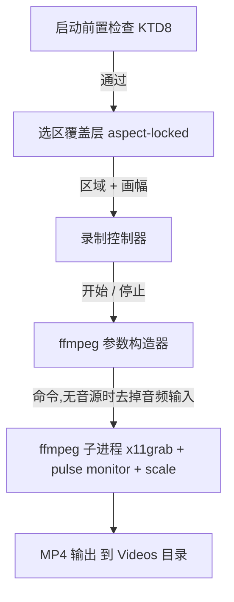
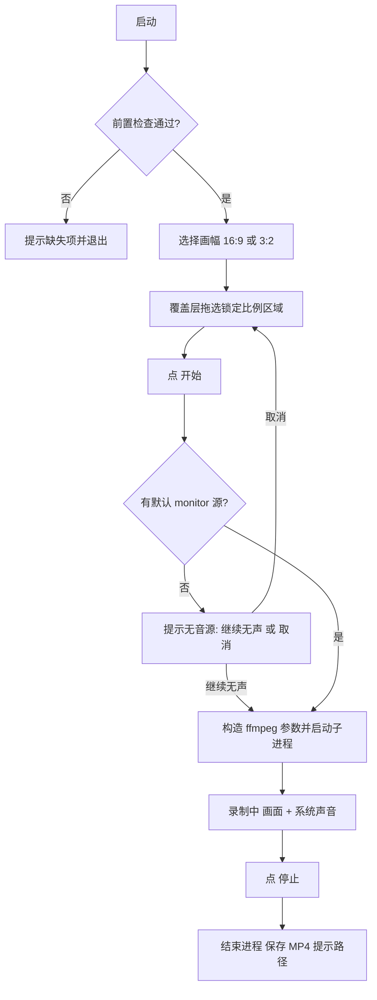

# Ubuntu 屏幕录制工具 - Plan

## Goal Capsule

- **Objective:** 在 Ubuntu 的 X11 桌面会话上,提供一个桌面应用,让用户框选屏幕上的一个矩形区域、选定画幅比、并开始/停止录制,最终把该区域的画面连同系统声音存成一份 1080p 的 MP4 文件。
- **Product authority:** jianfeng(个人自用)。
- **Means:** PySide6 桌面 GUI + 单个 ffmpeg 子进程:用 `x11grab` 抓取所选区域画面、用 PipeWire/Pulse 的默认 monitor 源抓取系统声音,经 `libx264` + AAC 编码为 1080p MP4;GUI 只构造 ffmpeg 参数并管理子进程生命周期,自身不解码任何画面帧(KTD1、KTD2、KTD4、KTD5)。
- **Open blockers:** 无。

## Product Contract

### Summary
一个 Ubuntu 桌面上的轻量录屏应用:选画幅(16:9 或 3:2)→ 拖拽框选一个锁定该比例的矩形区域 → 开始/停止,输出 1080p、含系统声音的 MP4。定位为个人自用,以稳定、够用、低打扰为第一目标。

### Problem Frame
现有 Ubuntu X11 上的区域录屏工具要么偏重(功能齐全的录屏套件)、要么不支持「锁定画幅 + 系统声音 + 1080p」这一组合;这里要的是一个个人自用、够用、低打扰的轻量区域录屏器。

### Key Decisions

- **平台锁定 Ubuntu + X11** (session-settled: user-directed — chosen over Wayland 与跨平台: 用户明确当前环境是 Ubuntu 并要求适配 Linux,且在 X11 / Wayland / 两者兼支持 三者中选了 X11)。运行环境限定为 X11 (Xorg) 会话,不做 Wayland 适配。Governs R9.
- **选区锁定画幅比** (session-settled: user-directed — chosen over 自由矩形后缩放留黑边 / 区域即画布: 在三个选项里选了「框选吸附到所选比例」)。拖框时约束到所选比例,保证输出恒为规整的 16:9 或 3:2。Governs R2, R3, R4.
- **只录系统声音** (session-settled: user-directed — chosen over 麦克风 / 系统+麦克风双轨: 在三个音频选项中选了「仅系统声音」)。Governs R5.
- **输出 MP4 (H.264)** (session-settled: user-directed — chosen over WebM/VP9 与任选: 在三个格式选项中选了 MP4)。Governs R8.

### Requirements

**捕获与选区**
- R1. 应用能捕获用户在屏幕上框选的矩形区域的视频画面。
- R2. 录制前,用户可在 16:9 与 3:2 之间选择输出画幅比。
- R3. 选区矩形被约束到所选画幅比:拖框所得矩形恒为所选比例,而非任意长宽比。
- R4. 输出视频分辨率为 1080p:16:9 对应 1920×1080,3:2 对应 1620×1080。

**音频**
- R5. 录制时同步采集系统内部声音(机器上正在播放的声音),并与视频同步写入输出。

**录制控制**
- R6. 用户通过应用内控件开始与停止录制;一次「开始 → 停止」产出一个文件,不提供暂停/续录。
- R7. 录制的画面不包含鼠标光标。

**输出**
- R8. 每次录制保存为一个 MP4 文件(视频 H.264、音频 AAC),存入用户可访问的位置,文件名可区分各次录制。

**平台**
- R9. 运行于 Ubuntu 的 X11 (Xorg) 桌面会话;不支持 Wayland。

### Key Flows

- F1. 录制一块区域
  - **Trigger:** 用户打开应用。
  - **Steps:** 选择画幅比(16:9 或 3:2) → 在屏幕上拖拽框选一个锁定该比例的矩形 → 点「开始」,开始录制该区域画面与系统声音 → 点「停止」结束 → 保存 MP4 并提示文件位置。
  - **Covers R1, R2, R3, R4, R5, R6, R7, R8.**
- F2. 无可用系统音源
  - **Trigger:** 点「开始」时检测不到可用的系统声音源。
  - **Steps:** 应用提示当前无法获取系统声音,并让用户选择「仍要继续(输出无声)」或「取消」。
  - **Covers R5.**

### Acceptance Examples

- AE1. **Given** 已选 16:9,**When** 用户拖拽框选,**Then** 选框被约束为 16:9,拖不出其它比例。Covers R3.
- AE2. **Given** 选区为 16:9 但原始区域像素非 1920×1080,**When** 录制完成,**Then** 输出 MP4 为 1920×1080。Covers R4.
- AE3. **Given** 正在录制且系统有声音播放,**When** 查看输出文件,**Then** MP4 内含与画面同步的系统音频轨道。Covers R5.
- AE4. **Given** 录制进行中,**When** 检查输出画面,**Then** 画面中不出现鼠标光标。Covers R7.

### Scope Boundaries
- 麦克风采集、多音源混音。
- 鼠标光标录入画面。
- 暂停/继续、分段或续录。
- 录制后编辑(裁剪、剪辑、加字幕/标注)。
- 多显示器 / 跨屏选区(本期按单主屏处理)。
- 定时/循环录制、全局快捷键启停。
- Wayland 会话支持与其它发行版的打包分发。

### Success Criteria
- 在目标 Ubuntu X11 环境下,从启动到产出第一个可正常播放的 1080p MP4 全程顺畅,无需额外手动配置。
- 输出文件可被常见播放器正常打开,画面与系统声音同步,无明显音画错位。
- 选定 16:9 或 3:2 后,输出画幅恒为该比例,画面清晰无畸变。

### Dependencies / Assumptions
- 运行于 Ubuntu 的 X11 (Xorg) 桌面会话(用户已确认);Wayland 不在本期范围。
- 系统声音采集依赖 PipeWire(用户已确认其环境为 PipeWire),或其兼容的 monitor/loopback 源。
- 系统具备可用的屏幕与音频捕获能力;捕获与编码的实现方式已在 Planning Contract 确定(KTD2–KTD7)。
### Outstanding Questions
- 无启动阻断项。原「Deferred to Planning」的条目已在 Planning Contract 中解决:GUI 框架(KTD1)、保存路径与文件名规则(KTD6)、编码默认与帧率(KTD7)、单主屏行为(见 Scope Boundaries)。

---

## Planning Contract

### Key Technical Decisions
- KTD1. GUI 技术栈 = Python 3 + PySide6 (Qt 6)。(session-settled: user-directed — chosen over GTK4:个人自用、Qt 的透明全屏覆盖层与事件处理最省事,无需引入 GTK 生态。)承载画幅选择、选区覆盖层、开始/停止控件与无音源提示(F2)。
- KTD2. 捕获与编码 = 单个 ffmpeg 子进程,同时挂两路输入(`x11grab` 画面 + Pulse/PipeWire monitor 声音)直接编码落盘;PySide6 侧只负责构造 ffmpeg 参数、启动/停止子进程、读取退出状态,全程不解码画面帧。(session-settled: user-approved — 薄 GUI + ffmpeg over in-process GStreamer:复用 ffmpeg 成熟的 x11grab 与编码路径,规避在进程内搭 GStreamer 管线并处理 X 抓帧的复杂度与依赖。)
- KTD3. 不录光标:用 `x11grab` 的 `-draw_mouse 0`,录屏画面不含鼠标,但屏幕上的系统光标保持可见(不隐藏)。此项细化并取代早前「隐藏系统光标」的取舍——当时因尚未发现 `draw_mouse` 才选了隐藏;现改用抓帧侧关闭鼠标,对用户屏幕零副作用,如需回退只改一个参数。Governs R7。
- KTD4. 系统声音采集 = 通过 Pulse/PipeWire 的默认 monitor 源:`-f pulse -i @DEFAULT_MONITOR`(用户环境为 PipeWire,经 pipewire-pulse 兼容层该源可用)。启动前与点「开始」时探测默认 monitor 源是否存在;缺失则走 F2(继续无声 / 取消)。(session-settled: user-directed — PipeWire 已确认。)Governs R5。
- KTD5. 输出分辨率 = 用 ffmpeg `scale` 滤镜强制到 1080p 目标尺寸:16:9 → `scale=1920:1080`,3:2 → `scale=1620:1080`。选区已按 KTD 锁定比例,故为等比缩放而非留黑边(letterbox)。Governs R4。
- KTD6. 保存位置 = `~/Videos/screen_YYYYmmdd-HHMMSS.mp4`,目录不存在则创建。Governs R8。
- KTD7. 编码默认:30 fps、H.264(`libx264`,CRF 质量档)、AAC 音频、MP4 容器,`yuv420p` 像素格式与 `+faststart`。帧率与质量档作为构造参数,后续可暴露为可选,不影响本期默认行为。Governs R4、R5、R8。
- KTD8. 启动前置检查(preflight):校验 `ffmpeg` 在 PATH、存在 X11 `DISPLAY`、以及可用的 PipeWire/Pulse 默认 monitor 源;任一项缺失即以清晰错误提示退出或降级,支撑「无需额外手动配置」的成功标准。

### High-Level Technical Design

应用是一个薄的 PySide6 前端,驱动一个 ffmpeg 子进程。启动时先做前置检查(KTD8);通过后用户选画幅(R2),全屏半透明覆盖层让 ta 拖出一个锁定该比例的选区(R3)。点「开始」时探测默认 monitor 源(F2 分支):存在、或用户选「继续无声」,参数构造器就组装出一条 ffmpeg 命令(`x11grab` 区域 + 可选 pulse monitor + `scale` 到 1080p + `libx264`/AAC)并启动子进程;「停止」终止进程;完成的 MP4 落在 KTD6 路径,应用提示其位置。





代表性 ffmpeg 命令(方向性示意,非实现规范;`x11grab` 几何字面与 `-i` 分隔符在实现期定):

```
ffmpeg \
  -f x11grab -draw_mouse 0 -framerate 30 -video_size <W>x<H> -i <DISPLAY>.0+<X>+<Y> \
  -f pulse -i @DEFAULT_MONITOR \
  -vf scale=1920:1080 \
  -c:v libx264 -preset medium -crf 20 -pix_fmt yuv420p \
  -c:a aac -b:a 192k -movflags +faststart \
  ~/Videos/screen_<YYYYmmdd-HHMMSS>.mp4
```

其中 3:2 用 `scale=1620:1080`;「继续无声」路径省略 `-f pulse -i @DEFAULT_MONITOR` 输入行与 `-c:a aac -b:a 192k` 音频编码器;`<W>x<H>` / `<X>+<Y>` 为所选区域的像素尺寸与左上角,`<DISPLAY>` 为 X11 显示器名;输出路径在 Python 侧先展开为绝对路径再传入(ffmpeg 不展开 `~`)。

### Assumptions
- 运行于单一 X11 (Xorg) 会话;以主显示器为选区基准,不做多显示器 / 跨屏(见 Scope Boundaries)。
- 音频栈为 PipeWire 且启用了 pipewire-pulse 兼容层,故 Pulse 协议的默认 monitor 源可用(KTD4);若目标机未启用,preflight 给出明确提示而非崩溃。
- 系统已安装含 `libx264` 与 Pulse 输入支持的 `ffmpeg`;preflight 校验缺失项(KTD8)。
- 区域按其原生像素尺寸抓取,再由 `scale` 到 1080p;因选区已锁比例,缩放为等比,不会引入黑边或畸变。

### Sequencing
U1 先行(脚手架 + 前置检查)。U2(覆盖层选区)与 U3(ffmpeg 管线)可并行开发,均构建在 U1 之上。U4(控制 + 无音源流 + 输出)集成 U2/U3。U5(验收验证与加固)收尾。关键路径:U1 → U3 → U4 → U5。

---

## Implementation Units

### U1. 工程脚手架 + 启动前置检查
- **Goal:** 建立 Python 3 + PySide6 工程骨架、入口点与依赖清单,以及启动前置检查(ffmpeg / X11 DISPLAY / 默认 monitor 源),缺失项给出清晰错误而非崩溃。
- **Requirements:** R9(运行于 X11);为 F2 的无音源检测打基础;支撑成功标准「无需额外手动配置」。
- **Dependencies:** 无。
- **Files:** `app/__init__.py`、`app/main.py`、`app/preflight.py`、`requirements.txt`、`tests/__init__.py`、`tests/test_preflight.py`。
- **Approach:** 本单元只做环境探测与工程接线,不含选区或编码。preflight 返回结构化结果(缺失项列表 + 是否可继续);入口据此进入主窗口或报错。引用 KTD1(GUI 栈)、KTD8(preflight)。
- **Test scenarios:**
  - ffmpeg 在 PATH → preflight 该项通过。
  - ffmpeg 不在 PATH → 报告该缺失项,应用给出可读错误。
  - 无 `DISPLAY`(非 X11 环境)→ 报告缺失项。
  - 存在默认 monitor 源 → 音频项通过;不存在 → 音频项标记为缺失(不致命,供 F2 使用)。
- **Verification:** 在目标 Ubuntu X11 会话运行入口可正常启动;在缺 ffmpeg 或非 X11 环境下给出明确错误而非崩溃;`pytest` 相关单测通过。

### U2. 选区覆盖层(锁定画幅比)
- **Goal:** 提供全屏半透明覆盖层,支持拖拽框选一个锁定所选画幅比(16:9 或 3:2)的矩形,并提供画幅选择控件;输出选区的整数像素矩形(左上角 + 宽高)。
- **Requirements:** R1(捕获所选区域)、R2(画幅选择)、R3(选区锁定比例)。
- **Dependencies:** U1。
- **Files:** `app/overlay.py`、`app/aspect.py`(比例约束数学)、`tests/test_aspect.py`。
- **Approach:** 覆盖层接管全屏输入;拖拽以起点为锚,移动时按所选比例求解整数矩形(按主轴确定尺寸),并夹取到屏幕边界内。比例约束的纯数学放在 `app/aspect.py` 以便单测。引用 KTD1。
- **Test scenarios:**
  - Covers AE1. 选 16:9,给定任意拖拽起止点 → 结果矩形宽高比恒为 16:9。
  - 选 3:2,任意拖拽 → 结果矩形宽高比恒为 3:2。
  - 拖拽跨越屏幕右 / 下边界 → 矩形被夹取,不越界,比例保持。
  - 极小拖拽(接近 0 尺寸)→ 返回一个最小有效矩形,不产生 0 宽 / 0 高。
- **Verification:** 在真实会话中拖动,框线始终贴合所选比例;确认后主窗口收到一个确定的整数矩形。

### U3. ffmpeg 捕获 / 编码管线
- **Goal:** 依据选定区域、画幅与输出路径构造 ffmpeg 参数并管理子进程(启动 / 停止 / 等待退出),产出 1080p、含系统声音的 MP4;无音源时构造去音频变体。
- **Requirements:** R1(区域画面)、R4(1080p)、R5(系统声音同步)、R6(开始 / 停止产出一个文件)、R7(不含光标)、R8(MP4 H.264+AAC)。
- **Dependencies:** U1。
- **Files:** `app/encoder.py`(参数构造 + 子进程管理)、`tests/test_encoder_args.py`。
- **Approach:** 参数构造器输入(区域矩形、画幅、输出路径、是否含音频)→ 输出 ffmpeg 参数列表。落点:`-draw_mouse 0`(KTD3)、`scale` 目标尺寸(KTD5)、pulse monitor 输入与 AAC 编码(KTD4)、输出路径(KTD6)、编码默认(KTD7)。子进程管理器负责 launch / stop / reap:stop 走优雅退出(向 stdin 写 `q` 或发 SIGINT),由 ffmpeg 正常收尾并写出 moov,避免硬杀导致 MP4 损坏不可播放;同时暴露退出码与「是否仍在录制」状态。无音频时省略 pulse 输入行与音频编码器。
- **Test scenarios:**
  - 给定 16:9 区域 + 有音频 → 参数含 `scale=1920:1080`、`-draw_mouse 0`、`-f pulse -i @DEFAULT_MONITOR`、`libx264`、`aac`,输出路径形如 `screen_*.mp4`。
  - 给定 3:2 区域 + 有音频 → 参数含 `scale=1620:1080`。
  - 给定无音频(继续无声)→ 参数不含 pulse 输入行与音频编码器。
  - 区域 X/Y/宽高正确映射到 `-i <DISPLAY>.0+<X>+<Y>` 与 `-video_size <W>x<H>`。
  - start 后 stop → 子进程被终止并回收,返回完成状态,不产生僵尸进程。
- **Verification:** 对一块有声音播放的区域录制数秒并停止,产出的 MP4 可被播放器打开,分辨率 1920x1080(或 1620x1080)、含同步音频、画面不含光标(AE2/AE3/AE4 的机器级核对在 U5 汇总)。

### U4. 录制控制 + 无音源流 + 输出接线
- **Goal:** 把开始/停止控件、无音源提示(F2)与输出路径接入可用应用,实现一次「开始 → 停止」产出一个文件(无暂停 / 续录),完成后提示文件位置。
- **Requirements:** R6(开始 / 停止、单文件、无暂停)、R5 / F2(无音源时继续无声或取消)、R8(提示文件位置)。
- **Dependencies:** U2, U3。
- **Files:** `app/controller.py`、`app/mainwindow.py`、`tests/test_controller.py`。
- **Approach:** 控制器状态机:未开始 → 选择中 → 录制中 → 完成。开始前先探测默认 monitor 源(KTD4):缺失则弹出 F2 选择,「取消」回到选择中、「继续无声」以去音频参数启动。停止即终止子进程并走 U3 的完成路径。引用 KTD2(GUI 只管理子进程)、KTD4、KTD6。
- **Test scenarios:**
  - 有音源时开始 → 进入录制中;停止 → 完成并给出文件路径提示。
  - 无音源时开始 → 出现 F2 选择;选取消 → 不启动、回到选择态;选继续无声 → 以去音频参数启动。
  - 一次「开始 → 停止」只产生一个文件;无暂停 / 续录入口。
  - 停止后重复开始 → 生成新的时间戳文件,不覆盖旧文件。
- **Verification:** 在目标会话走通 F1 与 F2 两条流程,分别得到「录出文件」与「取消」的预期结果,且无暂停相关控件。

### U5. 验收验证 + 加固
- **Goal:** 汇总端到端验收(1080p、音画同步、无光标、可播放、文件位置),补齐边界与错误处理加固,清理实验性代码。
- **Requirements:** 成功标准、AE1-AE4;R4 / R5 / R7 / R8 的端到端确认。
- **Dependencies:** U4。
- **Files:** `tests/test_e2e_smoke.py`、`README.md`(运行与依赖说明)、U1-U4 中必要的边界加固改动。
- **Approach:** 以目标会话手动冒烟为主(真 X11 + ffmpeg + 有音频),核对输出分辨率、音频存在且与画面同步、无光标、可被常见播放器打开、文件落在 `~/Videos`。把可脚本化的判定(如用 `ffprobe` 读分辨率与音频流)抽成辅助脚本。清理 U1-U4 中未落地的实验代码。
- **Test scenarios:**
  - Covers AE2. 16:9 选区录制完成 → 输出为 1920x1080。
  - Covers AE3. 有系统声音播放时录制 → MP4 含与画面同步的音频轨道(人工核对无明显音画错位)。
  - Covers AE4. 录制中检查画面 → 不含鼠标光标。
  - 停止后 `~/Videos` 出现 `screen_YYYYmmdd-HHMMSS.mp4`,播放器可正常打开。
  - 连续两次录制 → 两个不同时间戳文件,均正常。
- **Verification:** 目标环境从启动到产出第一个可正常播放的 1080p MP4 全程顺畅;AE1-AE4 逐条通过;无遗留实验代码。

---

## Verification Contract

| 关注点 | 命令 / 方式 | 证明 |
|---|---|---|
| 比例锁定 / 参数构造 / 前置检查 | `python -m pytest tests/ -q` | U1 / U2 / U3 的纯逻辑单测通过 |
| 录制端到端(需真 X11 + ffmpeg + 音频) | 手动冒烟:运行入口 → 选区 → 开始 → 停止 → 打开 MP4 | 产出 1080p、含同步系统音频、无光标、可播放 |
| 输出规格核对 | `ffprobe <mp4>` 读取分辨率与流 | 1920x1080 或 1620x1080;含 H.264 视频与 AAC 音频 |
| 无音源分支 | 在无默认 monitor 源环境走 F2 | 出现「继续无声 / 取消」,行为符合 F2 |

本期为 greenfield 仓库(当前仅 `docs/`),无既有 CI / 测试运行器;U1 引入最小 `pytest` 脚手架。真机捕获 / 编码无法在无显示环境跑 CI,故以目标 X11 会话的手动冒烟为准。

---

## Definition of Done

全局:
- U1-U5 全部完成且依赖满足。
- 目标 Ubuntu X11 会话从启动到产出第一个可正常播放的 1080p MP4 全程顺畅,无需额外手动配置。
- R1-R9 全部满足;AE1-AE4 逐条通过。
- 输出为 H.264 + AAC 的 MP4,16:9 = 1920x1080、3:2 = 1620x1080,含与画面同步的系统声音,画面不含鼠标光标。
- 无暂停 / 续录;一次「开始 → 停止」产出一个文件;文件名可区分各次录制。
- 未落地的实验代码已清理,不留 dead code。

分单元:

| Unit | Done when |
|---|---|
| U1 | 工程可启动;缺 ffmpeg / 非 X11 / 无 monitor 源时给出清晰提示而非崩溃;相关单测通过。 |
| U2 | 覆盖层拖选恒锁所选比例并夹取屏幕边界;比例数学单测通过。 |
| U3 | 参数构造对 16:9 / 3:2 / 有音频 / 无音频 均正确;子进程可干净启停;对一块有声区域能录出合格 MP4。 |
| U4 | F1 与 F2 两条流程走通;单文件、无暂停;完成后提示文件位置。 |
| U5 | AE1-AE4 端到端通过;`~/Videos` 文件可播放;无遗留实验代码。 |
