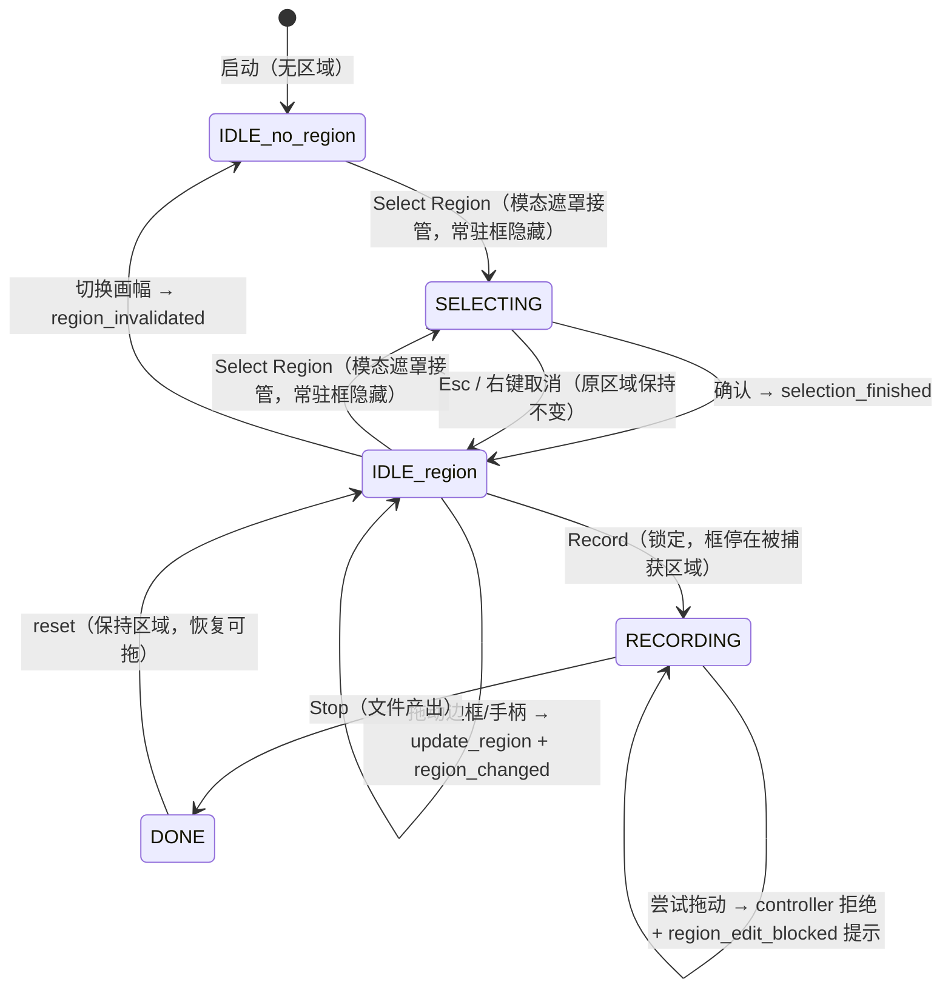
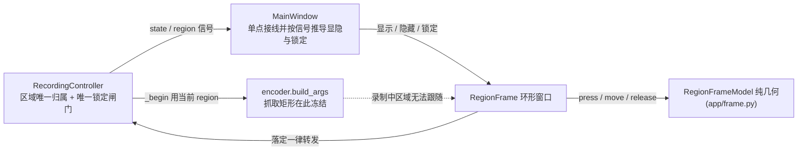

# 常驻可拖动录制选框 - Plan

## Goal Capsule

- **Objective:** 用户在使用录屏工具的任何时刻 —— 刚框完、等着按 Record、正在录、刚停止 —— 都能一眼看出屏幕上哪一块是被选中/被录制的位置，并且能直接用鼠标把这块框挪个位置或改个大小，不必重新框选、也不必读状态栏文字。
- **Authority:** jianfeng（个人自用，产品决策权威）。
- **Means:** 一个常驻的「区域边框」窗口（只覆盖区域外圈边带、中间镂空所以点击穿透）+ 一个无 Qt 依赖的纯几何状态机，复用既有 `snap_to_ratio` 的比例求解与夹紧逻辑；录制进行中改为只读显示（KTD1、KTD3、KTD4）。
- **Stop conditions:** AE1–AE5 通过；现有 60 个单测 + 2 个真机 e2e 不回归；抽帧检查证明录出的 MP4 中不含任何选框像素。
- **Execution profile:** 功能分支上按 U1→U2→U3→U4 增量提交，每个单元可独立成 commit；先把纯几何与单测做实，再碰 Qt 窗口与真机验证。
- **Owner:** ce-work 执行，jianfeng 验收。

---

## Product Contract

### Summary

给「已选区域」加一个常驻屏幕边框：只要存在选定区域就一直显示，且框体本身可拖 —— 拖边框整体挪位置，拖角部手柄在当前画幅比约束下改大小。录制进行中该边框继续显示正在被捕获的那块区域，但此时不可拖动（要换区域先 Stop），因为 ffmpeg 的 x11grab 抓取矩形在进程启动时就固定了。不改动捕获管线、输出规格与「一次开始→停止产出一个文件、无暂停」的既有语义。

### Problem Frame

现在的选区交互是一次性模态：`RegionOverlay` 在全屏遮罩里接受拖拽，用户确认（点击 / Enter）的瞬间 `mouseReleaseEvent` 与 `keyPressEvent` 都会 `emit` 区域然后 `self.close()`，屏幕上的框就没了，之后只剩主窗口状态栏里一行「Region W×H at (x, y)」。于是两个用户可感知的缺口：确认后无法用眼睛确认「到底选了哪一块」；录制全程是黑盒，画面之外没有任何位置指示。

上一版（`docs/plans/2026-09-19-2045-fix-recorder-runtime-fixes-plan.md` U3）解决的是「确认之前」的常驻，并且把「非交互常驻边框（点击穿透）」明确写进了 Deferred。这次补的就是那一块：让边框常驻到确认之后与录制全程，并且直接可拖。

另外 `RecordingController.begin_selection()` 在 `RECORDING` 状态下直接返回 False、主窗口也禁用 Select 按钮，所以**框选**这条改区域的路径在录制中本来就封着 —— 这是「录制中只读显示」这一产品选择的代码前提。但有一条还漏着：`MainWindow._on_state_changed` 只禁用 Select / Record / Stop，画幅下拉框在录制中仍可点，而 `RecordingController.set_aspect` 在 `RECORDING` 下清空 `_region` 却不发 `region_invalidated`（本机实测：录制中切 16:9→3:2 零事件、`_region` 变 None，Stop 后停在 done 且无区域）。常驻框一出现，这条路径就让屏幕上的框和 controller 持有的区域分家，必须本期一起收口（R5、U2）。

### Key Decisions

- **录制进行中区域锁定为只读，改区域要先停止录制**（session-settled: user-approved — chosen over 分段重启 ffmpeg + 停止时合并成一个文件：切换处会丢帧，且牵动「一次开始→停止 = 一个文件」的既有语义）。Governs R8.
- **常驻边框只画在区域之外，区域内部保持可点击**（chosen over 让现有全屏 dim 遮罩常驻：那会挡住用户在录制对象上的正常操作）。Governs R2, R3.
- **可拖动包含「整体移动」与「按比例缩放」两种，而不是只能挪位置**（session-settled: user-approved — chosen over 仅整体移动 + 回模态重新框选大小）。Governs R6.

### Requirements

**显示**

- R1. 只要存在已选定区域，屏幕上就持续显示该区域的边框：空闲、待录制、录制中、录制结束后都可见；没有区域时不可见。
- R2. 边框不得出现在录制产出的画面里，也不得遮挡其它程序窗口的可见内容。
- R3. 选框区域内部对鼠标是透明的 —— 落在区域内的点击命中其下方的真实窗口，而不是选框。
- R4. 点 Select Region 进入框选模态时，常驻边框隐藏（由模态遮罩负责显示选区），模态结束（确认或取消）后恢复。
- R5. 在非录制状态下切换画幅比使已选区域失效时，常驻边框立即消失；录制期间画幅选择器不可用，因此不存在「区域在录制中被悄悄清空」的中间态。

**交互**

- R6. 用户可用鼠标拖动边框本体整体移动选框；按住角部手柄可在当前画幅比约束下缩放选框。拖动的边界处理与框选时一致：夹紧在屏幕内、不小于既有最小边长。两种手势在未按住时就应能从指针形状分辨，录制锁定时给出「不可操作」的指针提示。
- R7. 拖动落定后，该区域立刻成为下一次录制使用的区域，主窗口的尺寸与坐标提示同步更新，且录制状态机不因此迁移状态。
- R8. 录制进行中边框显示正在被捕获的区域且不可拖动；用户尝试拖动时给出「停止录制后才能更改区域」的提示，而不是静默无反应。

### Key Flows

- F1. 直接拖动选框（未录制）
  - **Trigger:** 空闲状态下按住选框的边框条并拖动。
  - **Steps:** 边框跟手平移 → 松开鼠标 → 新区域写回 controller → 主窗口状态栏更新为新的 W×H 与坐标。
  - **Covers:** R6, R7
- F2. 录制中查看与尝试修改
  - **Steps:** 点 Record → 边框切到「录制中」样式并停在被捕获的区域上（画幅下拉框同时禁用）→ 用户按住边框拖动 → 窗口照常转发、controller 拒收并发 `region_edit_blocked` → 区域与画面都不变，出现一次提示 → 点 Stop 后恢复可拖。
  - **Covers:** R1, R8
- F3. 停止后调整再录一段
  - **Steps:** Stop 得到文件 → 拖角部手柄把区域改小 → 再点 Record → 新文件按新区域录制。
  - **Covers:** R6, R7

### Acceptance Examples

- AE1. **Given** 已选定一个 16:9 区域且未在录制，**When** 不再点任何按钮、直接看屏幕并点一下区域内部的某个应用窗口，**Then** 区域四周有细边框可见，且那次点击作用在下方应用上而不是选框。Covers R1, R3.
- AE2. **Given** 正在录制，**When** 按住边框拖动 200px 后松开，**Then** 边框位置不变、正在录的画面内容不受影响，并出现一次「停止录制后才能更改区域」的提示。Covers R8.
- AE3. **Given** 空闲且已选区域，**When** 按住右下角手柄向外拖动，**Then** 区域以左上角为锚按 16:9（或 3:2）等比放大，边框上的尺寸文字更新，主窗口状态栏出现同样的新 W×H 与坐标，之后按 Record 用的就是这个新区域。Covers R6, R7.
- AE4. **Given** 选区贴住屏幕某条边（如 y=0），**When** 完成一次录制并抽帧查看，**Then** 产出画面的任何像素都不是边框颜色；贴边那条既不画线也不画手柄，该方向的缩放改用对角手柄完成。Covers R2.
- AE5. **Given** 已有选区，**When** 把画幅从 16:9 切到 3:2，**Then** 常驻边框消失，状态栏提示重新选择。Covers R5.

### Scope Boundaries

**Deferred to Follow-Up Work:**
- 录制中实时切换捕获区域（分段重启 ffmpeg + 停止时合并为一个文件）—— KTD4 的备选，需要时才做。
- 选区/画幅/保存目录的跨启动持久化（沿用上一版的 deferred）。
- 多显示器与跨屏选框；暂停 / 续录。
- 选框吸附对齐（贴其它窗口边缘、网格）。

**Outside this product's identity:**
- 录制后编辑（裁剪、字幕）、麦克风与多音源、全局快捷键。
- 非 X11 平台（Wayland）下的区域指示。

### Success Criteria

- 「框在哪 = 录在哪」在任意时刻都能用眼睛直接确认，不需要读文字提示。
- 录出的 MP4 不含任何选框像素，贴边区域也不例外。
- 现有 60 个单测 + 2 个真机 e2e 全绿不回归。

### Sources / Research

- 上一版计划：`docs/plans/2026-09-19-2045-fix-recorder-runtime-fixes-plan.md`（U3 两阶段确认；其 Deferred 已点名「非交互常驻边框」）。
- 原始产品契约：`docs/plans/2026-07-11-2253-feat-linux-screen-recorder-plan.md`（origin 的 R6 无暂停、origin 的 R8 一次开始→停止一个文件、其 KTD2 GUI 不解码帧）。
- 现有实现：`app/overlay.py`（`SelectionModel` 纯状态机 + `RegionOverlay` 薄壳；确认后 `close()`）、`app/aspect.py`（`Region`、`snap_to_ratio` 的锚点/比例/夹紧、`MIN_SHORT_SIDE`）、`app/controller.py`（`State`、`begin_selection` 在 RECORDING 下拒绝、`set_aspect` → `region_invalidated`）、`app/encoder.py`（`build_args` 的 `-i <display>.0+X+Y` 与偶数化夹紧）、`app/mainwindow.py`（`_select_region`、`_on_state_changed`、`_on_region_ready`）。
- 本机 `ffmpeg -h demuxer=x11grab`（6.1.1）：`-x/-y/-grab_x/-grab_y/-video_size` 的标志位是 `.D.........`，无 runtime 位；对照 `-h filter=crop` 的 x/y/w/h 是 `..FV.....T.`。→ 运行期改抓取矩形不可行，这是 KTD4 与「录制中只读」的依据。
- ffmpeg 源码 `libavdevice/xcbgrab.c`（tag n6.1）的 `setup_window` / `draw_rectangle` / `xcbgrab_update_region`：`-show_region` 的指示框是一个 override-redirect 窗口，画在区域外扩 `region_border` 的位置，并用 XCB SHAPE 从中间挖空，每帧重新定位 —— 本次「外圈边带 + 中间镂空 + 不进画面」的既有先例。
- Qt 源码 `src/plugins/platforms/xcb/qxcbwindow.cpp`（6.7 分支）：`setMask` 只对 `XCB_SHAPE_SK_BOUNDING` 生效；`WA_TransparentForMouseEvents` 走 XFixes 把 `XCB_SHAPE_SK_INPUT` 设成空（即整窗穿透，无法只让中间穿透）。
- 本机 X11 实验（`DISPLAY=:1`，3440x1440，PySide6 6.11.2，脚本在仓库外的一次性探针）：带环形 mask 的常驻窗口 —— 中间区域的按下事件落到其下方窗口（穿透成立），mask 保留的边带能收到按下；同时确认 `WA_TranslucentBackground` 的窗口用样式表设背景不产生任何像素，必须 `paintEvent` 自绘。
- 回归基线：`.venv/bin/python -m pytest -q` → 60 passed, 2 skipped（e2e 需 `RUN_E2E=1`）。

---

## Planning Contract

### Key Technical Decisions

- KTD1. **常驻指示用一个独立的「环形」窗口，而不是让现有全屏遮罩常驻。** 新建 `app/frame.py`，其中 `RegionFrame` 是一个 frameless、`WindowStaysOnTopHint`、`X11BypassWindowManagerHint`（不受 WM 装饰与叠放干预，和 ffmpeg 指示框同一路线）、`WA_ShowWithoutActivating` 的窗口；几何取「区域矩形四边各外扩 max(MARGIN, 文字块尺寸)」再夹紧到屏幕，然后用 `setMask(整窗 − 区域)` 把中间镂空。镂空区输入穿透与边带可交互这两条性质已在本机验证，所以不依赖 `WA_TransparentForMouseEvents`（它是整窗全穿透，会让框拖不动）。空闲与录制共用同一个窗口实例，只切样式与交互开关。Governs R1, R3.
- KTD2. **硬不变式：边框的任何像素只允许画在区域矩形之外。** 线条、手柄、文字都放在外扩边带里；当某条边贴住屏幕边界导致边带放不下时，该边既不画线也不画手柄（外侧已无空间），该方向的缩放改用对角的手柄完成。理由：一旦出现一个画进区域内的像素，x11grab 就把它录进 MP4 且事后无法去除。现有 `RegionOverlay` 的尺寸文字是画在区域内部的（`rect.adjusted(...)` + AlignTop|AlignLeft），常驻框不能照抄这一段。Governs R2, AE4.
- KTD3. **拖动几何放进纯函数与纯模型，Qt 只做事件转发。**（session-settled: user-approved — 落地 Key Decisions 第三条「移动 + 按比例缩放」，chosen over 只支持整体移动的纯函数接口） `app/aspect.py` 增两个纯函数：`move_region(region, dx, dy, screen_w, screen_h)` 与 `resize_region_to_ratio(region, corner, x, y, aspect, screen_w, screen_h)`，与既有 `snap_to_ratio(x0, y0, x1, y1, aspect, screen_w, screen_h)` 同签名风格。缩放不重写比例解法，而是以对角为锚直接调用 `snap_to_ratio`，但先把指针坐标夹到「锚点之外还剩多少屏幕」以内 —— `snap_to_ratio` 结尾的位置夹紧按整屏计算，实测从锚点 (1000, 900) 出发会返回 y=90，锚点被搬走、缩放退化成搬动整框。`RegionFrameModel` 只持当前 `Region`、按下点与 grab 模式（`MOVE` / `RESIZE_<corner>`）；按下点落在角部 `CORNER_GRAB_PX` 内即为缩放，否则为移动；贴屏幕角的手柄朝屏外那侧没有命中区，实际缩放只发生在对角。允许不允许改写区域不由模型判断（见 KTD4、KTD5），模型只管几何。这样 Qt-free 的单测能覆盖全部几何。Governs R6, R7.
- KTD4. **录制进行中区域锁定为只读，不改捕获管线。**（session-settled: user-approved — chosen over 分段重启 ffmpeg + 合并: 依据 x11grab 抓取选项无 runtime 位，切换必然丢帧并牵动单文件语义。）实现上闸门只有一处，在 controller：`update_region` 在 `RECORDING` 下不改区域并发出 `region_edit_blocked`；`RegionFrame` 无论模型返回什么都不做拦截，落定一律转发给 controller —— 否则提示永远发不出来。常驻框里为样式服务的锁定标志只驱动描边颜色与指针形状，不参与任何写入判断。Governs R8.
- KTD5. **区域的唯一归属仍在 controller，窗口的显隐完全由状态推导。** `RecordingController` 新增 `region_changed` 与 `region_edit_blocked` 两个信号和 `update_region(region)`（只换区域、不迁移状态机）；既有的 `set_region` 改为委托 `update_region`（签名不动，tests/ 里 11 处调用照常绿），让写入路径只剩一条，否则 `set_region` 会绕过录制锁定并让框停在旧区域上。`MainWindow` 单点持有 `RegionFrame`，依据 `state_changed` / `region_ready` / `region_changed` / `region_invalidated` / `region_edit_blocked` 并在每次状态变化时按「controller 是否还持有区域」重导「隐藏 / 可交互 / 只读显示」，避免窗口与主窗口各自判断而漂移。Governs R1, R4, R5, R7.
- KTD6. **文字与状态标记一律位于边带内，不进入区域。** 尺寸与坐标标签、录制中的 REC 标记、「已锁定」提示都画在外扩边带内 —— 这条直接决定窗口矩形要按文字块尺寸外扩（KTD1），否则标签会被 mask 裁掉；样式分两态：空闲为既有青色细线 + 角部手柄，录制中为红色描边 + REC 标记（per KTD2 的不变式）。Governs R1, R2, R8.

Bake-off 未触发：三种候选机制（单个环形 mask 窗口 / 4 条独立边带窗口 / 直接借用 ffmpeg `-show_region`）已经足够具体、且决定性性质已在本机验证过，属于按证据判断而非需要先开发才能比较；翻转成本也只在同一模块内部。

### High-Level Technical Design

状态与常驻框的关系：



组件与归属（谁改区域、谁只读推导）：



窗口与区域的构成（directional，不是实现规格）：

```text
frame 窗口矩形 = 区域矩形四边各外扩 max(MARGIN, 文字块尺寸)（贴屏幕边的那侧夹紧到屏幕内）
mask          = 完整窗口矩形 − 区域矩形            # 中间镂空 → 输入穿透、也不画东西
可绘制/可点区   = mask ∩（4 条边带 ∪ 4 个角手柄 ∪ 文字块 ∪ REC 标记）
命中判定        = 距某角 <= CORNER_GRAB_PX ? RESIZE_该角 : MOVE   # 贴屏幕角时该角外侧无命中区
```

### Assumptions

- 单一主显示器、缩放因子 1（沿用 origin 的边界）；`QApplication.primaryScreen().geometry()` 给出的逻辑坐标与 x11grab 使用的设备像素等价 —— 与既有 `RegionOverlay` 的假设相同。
- X11 会话提供 XShape（Qt mask）；本机已验证。合成器（mutter 类）下 override-redirect 顶层的叠放次序在实现期确认，若被新窗口压在下面，退路是改成 WM 托管的 Tool + StaysOnTop 窗口（穿透性质不依赖 bypass 标志）。
- 现有 60 个 offscreen 单测 + 2 个真机 e2e 是可用的回归基线。
- 不新增第三方依赖，不改 `build_args` 的参数契约与输出规格。

### System-Wide Impact

- 新增一条贯穿全产品的实现约束：**任何由本应用自己绘制的东西都不得落在被录区域内部**（KTD2）。今天只有选区预览踩到这条线（文字在区域内），以后若让常驻框承担更多提示也必须遵守。
- 应用生命周期多了一个顶层窗口：主窗口关闭、进入模态遮罩、区域失效、录制中锁定画幅四条路径都要收口它的显隐与可交互性，否则要么在桌面上留一个残留框，要么留一个与 controller 分家的过期框。
- 捕获/编码侧（`encoder.py`、`preflight.py`）零改动。

### Sequencing

U1（纯几何与模型）是 U2/U3 的前提；U2（常驻窗口 + 接线）与 U3（录制态锁定与样式）都改 `app/frame.py`，必须顺序进行；U4 收口回归、抽帧验证与文档。顺序：U1 → U2 → U3 → U4。

### Deferred to Implementation (execution-time unknowns)

- `MARGIN`、`CORNER_GRAB_PX`、线宽与手柄尺寸的真机手感取值 —— 拖动命中率与「不遮挡」的平衡要上手才定得准。其中 MARGIN 有硬下限：不得小于文字块尺寸，否则尺寸标签会被 mask 裁掉（KTD1、KTD6）。
- 尝试拖动时那句提示的落点：画在边带内，还是走主窗口状态栏（后者更稳，但视线要离开录制区）。
- override-redirect 在全屏应用之上的叠放表现；确认需要退路时按 Assumptions 的第二条切换窗口标志。
- 录制中反复尝试拖动时提示的节流（一次/每次/冷却）—— 用真机手感决定。
- `RegionFrameModel` 需要的 aspect 与屏幕尺寸从哪来：建议与 `SelectionModel` 一致，在 `open_for(region)` 时按当前画幅与主屏几何构造，`set_aspect` 使区域失效后下一次构造刷新 —— 实现期确认取不到新画幅的路径。
- F3 流程里拖动会覆盖状态栏的「Saved: <path>」文字，是否要让它在录制结束后驻留几秒，交给手感验证。

---

## Implementation Units

### U1. 区域几何纯函数与常驻框状态机（R6, R7 / AE3）

- **Goal:** 让「移动选框」和「按比例缩放选框」在 Qt-free 层面完全可计算、可单测。
- **Requirements:** R6, R7；支撑 AE3、F1 的拖动与落定段。
- **Dependencies:** 无。
- **Files:** `app/aspect.py`、`app/frame.py`（新建，本单元只放模型）、`tests/test_aspect.py`、`tests/test_frame_model.py`（新建）。
- **Approach:**
  1. `aspect.py` 增 `move_region(region, dx, dy, screen_w, screen_h)`：尺寸不变，位置夹紧在屏幕内。
  2. `aspect.py` 增 `resize_region_to_ratio(region, corner, x, y, aspect, screen_w, screen_h)`：取 `corner` 的对角为锚点，先把目标坐标夹到「锚点到屏幕另一边」的剩余空间内，再以该锚点调用 `snap_to_ratio`（比例解法与 `MIN_SHORT_SIDE` 全部复用，不要在这里重写 w/h 计算）。锚点坐标在返回结果里必须原样不动 —— 这是「拖角缩放」唯一的位置契约。
  3. `frame.py` 内 `RegionFrameModel`：持 `_region`、`_press`、`_mode`；`press(x, y)` 依据距四角是否在 `CORNER_GRAB_PX` 内决定 `RESIZE_*` 或 `MOVE`，`move(x, y)` 返回当前预览区域，`release(x, y)` 返回落定区域（未发生位移时返回 None）。模型不做录制锁定判断 —— 锁定归 controller（KTD4）。
  4. 模型只持 `Region` 与整数，不 import Qt 类型（与 `SelectionModel` 同一约定）。
- **Patterns to follow:** `app/overlay.py` 里 `SelectionModel` 的纯状态机分层；`app/aspect.py` 的 `_clamp` 与比例解法。
- **Test scenarios:**
  - `move_region` 正常平移：`Region(400,300,640,360)` 右移 100 → x=500 且 w/h 不变。
  - `move_region` 贴边夹紧：左移使 `x+dx < 0` → x=0，尺寸不变；右/下越界同理夹到 `screen − w`。
  - `resize_region_to_ratio` 16:9 从右下角向外 200px：左上角坐标不变，w/h 比 ≈ 16/9（abs 0.01），面积增大。
  - `resize_region_to_ratio` 向内收缩到低于最小边长：结果被抬到 `MIN_SHORT_SIDE`（短边）且比例保持。
  - `resize_region_to_ratio` 拖出屏幕：尺寸收敛到锚点外的剩余空间、比例保持，且锚点坐标一字不变（本机已知反例：直接拿 `snap_to_ratio` 从锚点 (1000, 900) 求解会得到 y=90）。
  - 3:2 参数化跑一遍上面三条 resize 场景。
  - 角部判定边界：按下点距角点恰为 `CORNER_GRAB_PX` → `RESIZE`；阈值 −1 → `MOVE`。
  - 指针跨过锚点（向内拖到负尺寸）：结果停在最小尺寸，而不是翻转到锚点另一侧。
  - 贴屏幕角区域（如 `Region(0, 0, 1280, 720)`）从左上角缩放：该手柄朝屏外没有命中区，模型给出的仍是合法矩形，实际可用缩放在对角。
  - 无 press 直接 `move`/`release` 是空操作（对齐 `SelectionModel` 的宽松处理）。
- **Verification:** `tests/test_frame_model.py` 与 `tests/test_aspect.py` 全绿；`app/aspect.py` 除 `Region.as_qrect` 内部懒加载外仍不 import Qt。

### U2. 常驻边框窗口与主窗口接线（R1–R5, R7 / AE1, AE4, AE5）

- **Goal:** 桌面上出现一个真正常驻、可拖、中间穿透的选框窗口，并与既有状态机接好。
- **Requirements:** R1, R2, R3, R4, R5, R7；支撑 AE1、AE4、AE5；落地 F1 与 F3 的显示与接线。
- **Dependencies:** U1.
- **Files:** `app/frame.py`（新增 `RegionFrame` 窗口）、`app/mainwindow.py`、`app/controller.py`、`tests/test_mainwindow_frame.py`（新建）、`tests/test_controller.py`。
- **Approach:**
  1. `controller.py` 增 `region_changed` / `region_edit_blocked` 两个信号与 `update_region(region)`：`RECORDING` 下不改区域并发 `region_edit_blocked`（per KTD4），否则替换 `self._region` 并发 `region_changed`；不迁移状态。既有 `set_region` 改为委托 `update_region`，签名不变，使这条旧入口走同一条闸门与同一条通知。
  2. `RegionFrame` 用 U1 的模型驱动：`open_for(region)` 时把窗口几何设为「区域四边各外扩 max(MARGIN, 文字块尺寸) 并夹紧到屏幕」，`setMask(窗口矩形 − 区域)`，`raise_()`；`paintEvent` 按 KTD2/KTD6 只在边带内画 4 条线、4 个角手柄、尺寸文字；鼠标按下/移动/松开转发给模型算预览，落定**无条件**调用 `controller.update_region`（锁定与否由 controller 判，per KTD4），任何为样式服务的 `locked` 标志都不得截断这条转发。指针形状随命中区变化：边带上是四向移动，角部 `CORNER_GRAB_PX` 内是对角缩放，录制锁定时是不可操作。
  3. 窗口标志取 frameless + StaysOnTop + bypass-WM，属性取 `WA_ShowWithoutActivating`：显示时不抢焦点（抢焦点会让用户正在操作的窗口失焦，这是「低打扰」的硬要求）。
  4. `MainWindow` 单点持有 `RegionFrame` 并按 KTD5 接线：`region_ready` / `region_changed` 显示并跟随；每次 `state_changed` 额外按「controller 是否仍持有区域」重导一次显隐（堵住录制中改画幅留下的过期框）；进入 `SELECTING` 隐藏，`IDLE`/`DONE` 可交互，`RECORDING` 只读显示；`region_invalidated` 隐藏；`_select_region` 里打开遮罩前先隐藏常驻框，遮罩关闭（确认或取消）后按原区域恢复。`_on_state_changed` 在 `RECORDING` 下同时禁用画幅下拉框（与既有 Select / Record / Stop 的启停并列），并在进入 `RECORDING` 时把主窗口 `raise_()` 到常驻框之上 —— 常驻框是 bypass-WM 的顶层窗口，边带压到主窗口时不能把 Record / Stop 吃掉。
  5. 拖动落定后走既有 `_on_region_ready` 的文案路径更新状态栏，保证常驻框与状态栏不会各说一套。
- **Patterns to follow:** `RegionOverlay` 的 `paintEvent` + `mousePressEvent`/`mouseMoveEvent`/`mouseReleaseEvent` 写法；`MainWindow._on_state_changed` 的集中式启停控制；`conftest.py` 的单一 offscreen `QApplication`。
- **Execution note:** mask 镂空带来的「中间穿透、边带可点」只能靠真机 X 会话证明，离屏单测通过不代表它成立 —— 别把单测绿当成该性质的证据。
- **Test scenarios:**
  - Covers AE1: controller 有区域且状态为 idle → 常驻框可见，窗口几何等于区域四边各外扩 max(MARGIN, 文字块尺寸)。
  - 无区域 / 区域被清空 → 常驻框不可见。
  - Covers R4: `begin_selection` 后常驻框隐藏；`selection_finished` 与 `selection_cancelled` 后都恢复可见。
  - Covers AE5: `set_aspect` 改变比例触发 `region_invalidated` → 常驻框隐藏且状态栏提示重新选择。
  - Covers R7: `update_region(new)` 触发 `region_changed`、`state` 保持 IDLE、再次 `start_recording` 时注入的 recorder 收到的是 new（用 FakeRecorder 断言收到的 region）。
  - Covers R5（录制态）: 录制中 `_aspect_box` 为 disabled，改画幅既不改区域也不触发 `region_invalidated`。
  - `set_region` 与 `update_region` 同一条闸门：录制中 `set_region` 不改区域并发 `region_edit_blocked`；空闲时两者都发 `region_changed`。
  - 区域贴屏幕左上角 (0,0) → 窗口几何夹紧到屏幕内，仍可见且不越界。
  - 主窗口关闭时常驻框随之不可见（防止残留顶层窗口）。
  - Integration: 模型的 `release` 返回新区域 → 常驻框转发 → controller 写入 → 状态栏文字含新的 W×H 与坐标。
  - 既有回归面：`tests/test_controller.py` 与 `tests/test_mainwindow_timer.py` 里 11 处 `set_region` 调用在并轨后全部保持通过。
- **Verification:** offscreen 单测全绿；真机会话里框完确认后不点任何按钮就能看到常驻边框，点击区域内部能操作下方应用，拖边框后状态栏数字跟着变，再 Record 得到的是新区域。

### U3. 录制态只读显示与状态样式（R1, R8 / AE2）

- **Goal:** 录制中边框如实显示正在被捕获的区域，拖动被明确拒绝并给出提示。
- **Requirements:** R1, R8；支撑 AE2；落地 F2。
- **Dependencies:** U2.
- **Files:** `app/frame.py`、`app/controller.py`、`app/mainwindow.py`、`tests/test_mainwindow_frame.py`。
- **Approach:**
  1. 进入 `RECORDING` 时把常驻框置录制态（红色描边 + 边带内 REC 标记 + 不可操作指针），`Stop` 后恢复空闲样式与可交互指针。
  2. 提示的唯一来源是 `controller.region_edit_blocked`，由 `MainWindow` 落地（边带内或状态栏二选一，见 Deferred，两处都必须遵守 KTD2）。常驻框不做第二次判断，模型也不设锁定闸门 —— 规则归 KTD4，其它层只引用。
  3. 录制中的拖动照常走完 U1 的几何并照常转发：模型给出新区域、controller 拒收并回 `region_edit_blocked`，屏幕上的框停在被捕获的区域不动。
- **Patterns to follow:** `_on_state_changed` 现有的按状态集中控制；`State` 枚举驱动的样式切换。
- **Execution note:** 先写一条「录制中拖动应保持不变并给出提示」的失败测试，再实现锁定。
- **Test scenarios:**
  - Covers AE2: 录制态跑一次拖拽序列，controller 区域不变、常驻框几何不变，`region_edit_blocked` 恰好发出一次。
  - 录制中重复尝试拖动 → 提示按实现期的节流策略计数（先断言「至少一次、且区域不变」，把节流数值留在 Deferred 里）。
  - `Stop` → 解锁；下一次尝试拖动区域真的改变。
  - 录制中样式标志为录制态、停止后回到空闲态（断言状态标志，不做截图）。
  - 录制中 `region_changed` 不发出（防御 R8 与 R7 不冲突），且 `set_region` 这条旧入口同样被拦（与 U2 同一条闸门）。
  - 与计时显示并存：进入 RECORDING 时计时照常启动，锁定提示不得停掉计时器。
- **Verification:** 真机录制中拖框 → 画面与边框都不动并出现提示；Stop 后拖框立刻生效；`tests/test_mainwindow_frame.py` 全绿。

### U4. 回归、抽帧验证与文档（Success Criteria）

- **Goal:** 用产出物本身证明「选框不进画面」，并把交互变化写进使用说明。
- **Requirements:** R2；Success Criteria 全部。
- **Dependencies:** U1, U2, U3.
- **Files:** `tests/test_e2e_smoke.py`、`README.md`。
- **Approach:**
  1. 全量 offscreen 回归，确认既有 60 条不回归。
  2. 真机 e2e 增加一条抽帧断言：先在同一个 `Region(0, 0, 1280, 720)` 上把 `MainWindow` + `RegionFrame` 真实显示出来，再启动录制进程，然后从产出的 MP4 取一帧，检查区域四边内侧若干像素不等于边框/手柄的配色，证明 KTD2 的不变式在真实捕获路径上成立。**常驻框必须真的在屏幕上** —— 沿用现有 `_record`（它只构造 ffmpeg 参数并直接起进程，屏幕上没有任何本应用的绘制内容）会让这条断言恒真、等于没测。抽帧与「先显示窗口再录制」都是新能力（现有 e2e 只做 `ffprobe` 流校验），按 `test_e2e_smoke.py` 的门控与失败信息风格补齐。
  3. README 使用说明补：常驻边框的存在与含义、如何拖动移动与按比例缩放、录制中为何不可改区域、切换画幅会让边框消失。
  4. 走一遍完整手动冒烟：启动 → 框选确认 → 看到常驻框 → 拖动改位置 → 点进区域内其它应用 → 录制中拖框被拒 → 停止 → 改大小再录 → 抽帧确认画面干净。
- **Patterns to follow:** `tests/test_e2e_smoke.py` 现有的 `RUN_E2E` 门控与 `ffprobe` 校验写法；它的 `_record` 已经在用一个贴左上角的 `Region(0, 0, 1280, 720)`，抽帧检查可以直接挂在这条路径上。
- **Test scenarios:** 抽帧像素断言（happy path + 贴边区域的边界用例各一条）；其余行为已由 U1–U3 单测覆盖。
- **Verification:** `.venv/bin/python -m pytest -q` 全绿（新增用例计入）；`RUN_E2E=1` 的真机用例含新抽帧断言通过；README 描述与实际操作一致，无残留实验代码在仓库内。

---

## Verification Contract

| 检查 | 命令 / 动作 | 期望 |
|---|---|---|
| 单元与逻辑（Qt-free 几何 + 状态接线） | `.venv/bin/python -m pytest -q` | 现有 60 条不回归，新增 `test_frame_model.py` / `test_mainwindow_frame.py` 全绿；3 条 e2e 跳过（原 2 条 + U4 新增抽帧用例） |
| 真机捕获 + 选框不进画面 | `RUN_E2E=1 .venv/bin/python -m pytest tests/test_e2e_smoke.py -v` | 全部通过，含 U4 新增的抽帧像素断言；该断言只在常驻框已显示时才有意义 |
| 穿透与叠放（离屏测不出） | 真机会话：显示常驻框后点击区域内部的其它窗口；再把选框拖到跨过本应用的 `Record` / `Stop` 按钮 | 区域内点击作用在下方窗口；常驻框不闪、不抢焦点；按钮仍可点、状态文字仍可读 |
| 交互手感 | 真机会话：拖边框移动、拖角手柄缩放、录制中试着改画幅 | 跟手、比例锁定、锚点不漂移、贴边不越界、状态栏同步；录制中画幅下拉框为禁用 |
| 依赖与契约 | 不新增第三方依赖；`build_args` 与 `State` 语义不变 | diff 中无 requirements 变更、无 ffmpeg 参数契约变更 |

---

## Definition of Done

- **Global:** AE1–AE5 在真机上逐条成立；两条验证命令全绿；录出的 MP4 抽帧不含选框像素；README 与实现一致；工作树内没有探针/实验残留文件。
- **U1:** 移动与按比例缩放在纯函数层各有贴边、最小尺寸、越界、锚点不漂移四类用例通过；缩放复用 `snap_to_ratio` 而没有第二套比例解法。
- **U2:** 常驻框在 idle/done 显示、SELECTING 隐藏、region_invalidated 消失、RECORDING 只读；中间穿透与边带可拖在真机成立；`update_region` 不改状态机，`set_region` 已并轨到同一条闸门。
- **U3:** 录制中拖框被拒且有提示，Stop 后可拖；录制样式与空闲样式随状态切换。
- **U4:** 抽帧断言进入 e2e 并通过；文档更新完成。

---

## Implementation Notes (实现期结论与偏离)

按 U1→U4 落地后与本文档的出入，全部有代码/测试为证：

- **KTD1 的机制换成了「5 个实心矩形」，不是单个环形 mask 窗口。** `app/frame.py`
  实际由 top/bottom/left/right 四条边带 + 一个标签页组成。原因：本机 Qt 的
  `setMask` 只改 XCB 的 BOUNDING shape，INPUT 区域仍是整矩形，结果区域内侧的点击被
  常驻框吃掉（R3 不成立）。改成「区域上方根本不存在窗口」的矩形拼法后，
  R2（不进画面）与 R3（穿透）都由构造保证，并被
  `tests/test_mainwindow_frame.py::test_no_piece_covers_any_pixel_of_the_recorded_area`
  与 U4 的抽帧检查分别把住离屏与真机两道关。KTD2 的硬不变式不变。
- **`app/encoder.py` 破例改了一处，且必须改。** U4 的抽帧断言在贴边用例里通过、在
  `Region(1200, 400, …)` 用例里暴露出：x11grab 的 `-i <display>.0+X+Y` 字面里，
  第一个 `+` 之后的 `+Y` 不被解析，y 偏移静默留在 0（实测同一时刻的整屏抓取与
  `+X,Y` / `-grab_x` `-grab_y` 两种写法互为对照）。也就是说常驻框显示的区域与真正
  被录下来的区域在 y 上分家，直接否掉「框在哪 = 录在哪」这条 Success Criterion。
  现改为 `-grab_x`/`-grab_y` 显式选项 + 裸 `:display.screen` 输入，
  由 `tests/test_encoder_args.py::test_grab_offset_never_travels_in_the_filename`
  锁住，并由 `tests/test_e2e_smoke.py` 的两条抽帧用例在真机上验证。
- **真人指针的机器验证补做了，并揪出两处「离屏全绿、真机不成立」的缺陷。** 用 XTEST
  注入真实按下/移动/松开（脚本在仓库外，python-xlib 不是本项目的依赖）跑一遍 F1/F3：
  24 项断言逐条成立 —— 选框常驻、拖边条平移、拖角缩放（锚点不漂移、比例锁死）、
  录制中显示且拖不动、停止后恢复可拖。其中两条当场暴露问题：
  * **角部正对着屏幕外的那一小块（BAND×BAND）原本不属于任何窗口**，鼠标按在
    几何角点上会穿到桌面底下，缩放毫无反应（R6 的「按住角部手柄」落空）。
    `band_window_rects` 里上下两条边带改为左右各外扩一个 BAND，把四个角方块盖住；
    区域第一个像素仍然不属于本应用（R3 不破）。
  * **录制中那次被拒的拖动，边带会先跟手扫过被抓取的区域再被 `sync_to` 拉回**，
    而 x11grab 一直在按 30fps 采样，于是这些帧被永久编进 MP4（实测同一路径下
    成片里能数出几千个红像素，`-ss 1.0` 这类单帧抽查恰好落在动作之外，看不出来）。
    现在 `locked` 期间 `update_drag`/`end_drag` 不再搬动窗口：只按 KTD4 在松开时照常
    把候选区域交给 controller 拒收与提示，屏幕上的框自始至终停在被录的那块。
    `tests/test_mainwindow_frame.py::test_a_locked_drag_keeps_every_band_off_the_captured_pixels`
    钉住离屏这一面，`tests/test_e2e_smoke.py::test_e2e_frame_pixels_absent_while_a_drag_is_refused`
    逐帧扫成片钉住真机这一面（去掉修复后两条都会红）。
- **Verification Contract 里「穿透与叠放」「交互手感」两行仍需真人上手**：
  X 服务端的路由已用注入指针在真机跑通（见上一条），剩下的只是叠放与手感：
  本机 mutter 会话实测 override-redirect + StaysOnTop 的边带盖在最大化的终端之上
  （计划 Assumptions 第 2 条的疑虑可以关掉），拖动手感仍请真人评判。
  抽帧用例自带反真空前提（边框必须真的画在屏幕对应位置，否则先失败），
  因此它通过 = 边框确实在屏幕上、且录出的像素里没有边框。
