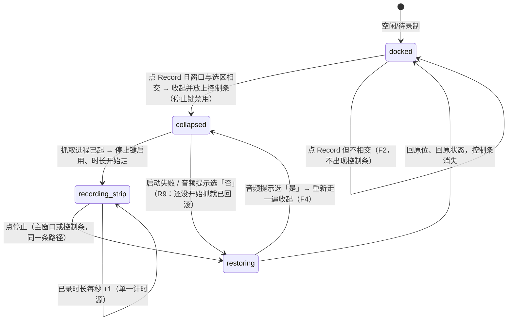
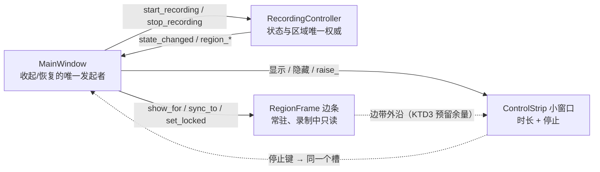

# 录制时收起界面、改用窄控制条 - Plan

## Goal Capsule

- **Objective:** 录制的那几分钟里，录出来的画面里不再有本应用自己的窗口 —— 用户把界面压在选区上、按下 Record、看回放，画面从头到尾只有被选中的那块内容；同时不需要为了停止录制而先把界面找回来。
- **Authority:** jianfeng（个人自用，产品决策权威）。
- **Means:** 录制开始前把主窗口收起，改用一条独立的小控制条窗口（只显示已录时长与停止键）贴到选区之外的屏幕边带；离开录制态时按原位原状态恢复（KTD1、KTD2）。
- **Stop conditions:** AE1–AE7 成立；真机抽帧证明成片里既没有主窗口也没有控制条的像素；现有 125 条离屏单测 + 5 条真机用例不回归。
- **Execution profile:** 功能分支上按 U1→U4 增量提交；先把纯几何与判定做实，再碰窗口与接线，最后收口真机证明与文档。
- **Owner:** ce-work 执行，jianfeng 验收。

---

## Product Contract

### Summary

录制期间把 600×190 的主窗口从桌面上收起来，换成一条只在录制时存在的窄控制条：显示已录时长和一个停止键，按 顶→底→左→右 落在第一个放得下的屏幕边带上（四条边带都放不下时取间隙最大的一侧，并列时按同一顺序取第一个），位置由算法定死、不可拖动。停止录制（或录制根本没起来）时，主窗口按原来的位置和状态回来，控制条消失。主窗口本来就不在选区里时，一切照旧。这条改动把上一期为常驻选框立下的硬不变式「本应用画的东西不进被录区域」扩展到应用自己的操作界面上。

### Problem Frame

`MainWindow` 是一个普通托管窗口，用户可以把它拖到选区上面 —— 而常驻选框现在会把「正在录哪一块」讲得清清楚楚，于是缺陷变得前所未有地显眼：框在屏幕上看得见，录出来的文件里也带着那个窗口。上一期做「常驻可拖动选框」时，验证方式已经升级成「抽帧读像素」，那次改动揪出过两个「离屏全测不到、真机才成立」的缺陷（`docs/plans/2026-09-20-1147-feat-persistent-region-frame-plan.md` 的 Implementation Notes：一次被拒的拖动让边条在几百毫秒内扫过被录区域，成片里多出几千个红像素）。同一类缺陷在界面这一侧仍然存在，而且比边条严重得多：整个窗口一直在画面里。

两个结构性事实决定了这次不能简单地「按状态推导显隐」：

- `RecordingController._begin()` 先 `recorder.start()`、后 `_set_state(State.RECORDING)`，也就是抓取进程已经起来、`state_changed` 才发出。若收起动作挂在状态回调上，最先进进文件的就是那张 600×190 的窗口 —— 与上面那条红像素是同一个失效机制。
- Record 按钮今天直连 `controller.start_recording`，主窗口侧没有可以插手的接缝；Stop 同理。

### Requirements

**画面干净**

- R1. 进入录制时，若主窗口与选区相交，主窗口必须在抓取进程启动**之前**就从桌面上消失；抓取进程启动不得因此延后或改变参数。
- R2. 录制期间，本应用画在桌面上的所有像素（控制条含文字与按钮）都不得落在被录区域内；空间允许时控制条必须整条位于区域之外。
- R3. 主窗口不与选区相交时，不收起、不出现控制条，交互与今天完全一致。

**控制条**

- R4. 收起后，桌面上存在一条窄控制条，只显示已录时长与停止键；时长与主窗口的计时同源，格式一致（MM:SS，超 1 小时 HH:MM:SS）。
- R5. 控制条的落点由算法决定并在此刻固定：在「顶、底、左、右」四个屏幕边带里按序取第一个放得下的（first-fit），四条都放不下时落在间隙最大的一侧、并列时仍按同一顺序取第一个；录制期间不可拖动，也不随鼠标改变位置。
- R6. 控制条与常驻选框的边条不得互相遮盖：边条该露出来的部分照常露出，控制条的停止键任何时候都能被点到。
- R7. 控制条显示时不抢焦点，也不覆盖选区内部，区域内的点击仍落到下方窗口；其停止键无需先激活窗口即可用鼠标点中。
- R11. 收起状态下的停止只有鼠标这一条路：本期不做全局快捷键，键盘停止不在范围内。

**回来**

- R8. 停止录制后，主窗口按收起前的屏幕位置与状态恢复显示，控制条消失；恢复不得晚于成片文件名的显示（状态栏仍要说「Saved: <path>」）。
- R9. 录制没能真正开始的路径（探测不到系统音源后用户选择不继续、启动 ffmpeg 失败）一律回到未收起的状态，不留「界面收起了但没在录」的中间态；并且从收起的那一刻起桌面上就有控制条可点（抓取真正起来之前停止键禁用），任何时候都不出现「主窗口和控制条都不在屏幕上」的空档。
- R10. 一次「开始 → 停止」仍只产出一个文件，无暂停；控制条的停止键与主窗口的 Stop 走同一条停止路径，不产生第二套收尾逻辑。

### Key Decisions

- **只有主窗口压住选区时才收起**（session-settled: user-directed — chosen over 一录制就一律收起 / 给用户一个开关：界面本来就在画面外时不该无端消失）。Governs R3.
- **选区外没有位置时仍然收起**（session-settled: user-directed — chosen over 维持现状把界面录进去 / 录制前中止并要求缩小区间：控制条占地远小于整窗口，且不该为了干净牺牲全屏录制这条路）。Governs R2, R5.
- **控制条位置算出来即固定，不给拖动**（session-settled: user-directed — chosen over 可拖到区域外任意位置 / 提供换边按钮：录制中本就不动任何界面元素，固定才可能既保证 R2 又可测）。Governs R5, R6.
- **落点用 first-fit（顶→底→左→右第一个放得下的边带），不是「选空隙最大的那条边」**（agent-proposed — chosen over best-fit：first-fit 与上一期边条的确定性排布同族，区域被微调时控制条不会突然跳边，且能被一条单测钉死）。Governs R5.
- **控制条随收起一起出现、停止键到 RECORDING 才启用**（agent-proposed — chosen over 接受一段「桌面上没有可点界面」的探测空档：音频探测是 GUI 线程上的同步调用（`check_audio_monitor` 的 timeout 6 秒），若把控制条挂在 `state_changed` 上，每次正常开始录制都会违反 R9 的承诺）。Governs R9.
- **常驻选框的既有规则不变**（沿用上一期：录制中区域只读，改区域先停止；边框只画在区域外侧、区域内保持可点）。本期把同一条硬不变式的适用对象从「选框」扩展到「本应用的任何窗口」。

### Key Flows

- F1. 压在选区上录制，再从控制条停止
  - **Trigger:** 主窗口与选区相交，用户点 Record。
  - **Steps:** 收起主窗口并立刻放上控制条（停止键禁用、时长停在 00:00）→ 启动抓取 → 进入录制态，停止键可用、时长开始走 → 用户点控制条的停止 → 停止抓取 → 主窗口回原位、状态栏显示成片路径 → 控制条消失。
  - **Covers:** R1, R4, R6, R8, R10
- F2. 界面在选区之外
  - **Steps:** 点 Record → 不收起、不出现控制条 → 录制照常 → Stop 照常。
  - **Covers:** R3, R10
- F3. 全屏选区（区域外没有边带）
  - **Steps:** 点 Record → 收起 → 四条边带都放不下，按并列顺序落在顶侧，因而位于区域之内 → 录出来的画面带着这条窄控制条 → 停止后恢复。
  - **Covers:** R2 的边界、R5
- F4. 没有系统音源
  - **Steps:** 点 Record → 收起并放上控制条（停止键禁用）→ 音频探测失败 → 先回滚收起（主窗口回来、控制条消失，因为提示的宿主正是那个主窗口）再问「是否无声录制」→ 选「是」→ 同一个收起动作再做一遍，抓取起来后停止键启用；选「否」→ 界面保持回滚后的样子。
  - **Covers:** R9

### Acceptance Examples

- AE1. **Given** 主窗口盖住选区中央，**When** 点 Record、录 5 秒后点控制条的停止，**Then** 录制期间桌面上只见控制条不见主窗口，且成片中既找不到主窗口的任何像素、也找不到控制条的任何像素。Covers R1, R2, R4, R8, R10
- AE2. **Given** 选区贴着屏幕顶部（y 很小）而屏幕底部有大片空白，**When** 进入录制，**Then** 控制条出现在底部边带，顶部那条红色边条仍完整可见，两者互不遮盖。Covers R2, R5, R6
- AE3. **Given** 选区铺满整个屏幕，**When** 进入录制，**Then** 界面仍然收起、控制条按并列顺序显示在顶侧（`inside` 为真），且 README 明说这种选区下控制条会被录进去。Covers R2, R5
- AE4. **Given** 正在录制，**When** 用鼠标点控制条上的停止，**Then** 录制停止、文件产出、主窗口回到收起前的屏幕位置与状态。Covers R6, R8, R10
- AE5. **Given** 系统音源探测失败，**When** 点 Record 后在提示里选「否」，**Then** 主窗口没有被收起的残留状态、控制条消失、状态栏不显示录制中。Covers R9
- AE6. **Given** 主窗口整体位于选区之外，**When** 点 Record 录制若干秒，**Then** 主窗口始终可见、桌面从未出现控制条，成片内容与不收起时一致。Covers R3
- AE7. **Given** 正在录制且控制条可见，**When** 在另一个应用窗口里敲键盘、并点击选区内部的一处控件，**Then** 键盘输入仍落到那个应用、那次点击仍作用在区域下方的窗口上，控制条不因此变化。Covers R7

### Success Criteria

- 「录出来的画面里没有本应用自己」对整窗口和控制条同时成立，并且像上一期一样由抽帧读像素来证明，而不是靠肉眼或断言的善意。
- 用户不需要为了停止录制而寻找界面：录制期间桌面上一定有且只有一个能点的地方。
- 现有 125 条离屏单测 + 5 条真机用例全绿不回归。

### Scope Boundaries

**Deferred to Follow-Up Work:**
- 常驻选框标签条文字被裁成约 20×20 的既有缺陷（`app/frame.py` 里 `piece_rects()` 把 `tab_height()` 同时当作宽和高传给 `band_window_rects`，`min(max(w, tx), tx)` 恒等于 `tx`，`TAB_MIN_WIDTH` 形同虚设）。本期不依赖它，也不靠它承载信息；修它需要另立一处宽度判定。
- 控制条可拖动 / 用户可自选落在哪条边。
- 选区、画幅、保存目录的跨启动持久化。
- 多显示器与跨屏选框；暂停 / 续录。
- 全局快捷键停止 —— R11 承认它是收起状态下的已知缺口，不在本期补一半。

**Outside this product's identity:**
- 录制后编辑、麦克风与多音源。
- 非 X11 平台（Wayland）下的界面收起。

### Sources / Research

- `docs/plans/2026-09-20-1147-feat-persistent-region-frame-plan.md` —— 常驻选框的 KTD2「任何像素不得落在区域内」与 Implementation Notes（瞬时越界也会被编进文件）；本期把该不变式扩展到主窗口与控制条，并沿用其「纯几何 + 薄壳窗口 + 主窗口单点接线」分层。
- `app/controller.py`（`_begin` 先 `recorder.start()` 后 `_set_state`；`audio_missing` 在状态迁移之前发出；`state_changed` 载荷是 `state.value` 字符串）、`app/mainwindow.py`（Record/Stop 直连 controller；`_on_state_changed` 集中控制启停；`_sync_frame` 单点推导选框显隐；`closeEvent` 收起选框）。
- `app/frame.py`（`_Piece` 的窗口配方：frameless + StaysOnTop + X11BypassWindowManagerHint + `WA_ShowWithoutActivating`；`band_window_rects` 的纯几何写法）、`app/overlay.py`（`SelectionModel` + 薄壳窗口的分层）。
- 本机验证事实：隐藏主窗口不会触发 `lastWindowClosed` 退出；但只要还有可见顶层窗口，关闭主窗口就不会退出进程；`restoreGeometry()` 在本机离屏平台会同时改写两轴（`move(1234,567)` → `pos() (197,567)`；`move(0,0)` → `(0,23)`）；`setFixedSize(600, 190)` 与布局最小尺寸 667×68 冲突（宽度本就已溢出），把同一窗口改窄会裁掉现有控件；离屏平台下从未 `show()` 的顶层窗口 `isVisible()` 天生为假、`activeWindow()` 恒为 None，二者都不能当作收起/抢焦点的证据。
- 回归基线：`.venv/bin/python -m pytest -q` → 125 passed, 5 skipped。

---

## Planning Contract

### Key Technical Decisions

- KTD1. **收起动作发生在「请求开始」的那一刻，而不是状态回调里。** MainWindow 新增自己的 `_start_recording()` / `_stop_recording()` 槽，按钮与信号一律接这两个槽，不再直连 controller；`_start_recording()` 先按需收起，再调 `controller.start_recording()`。理由：`_begin()` 在 `recorder.start()` 之后才发 `state_changed`，挂在状态上的收起会让窗口出现在成片开头几十毫秒里 —— 这正是上一期抽帧检查揪出的同类缺陷。恢复仍以 `state_changed` 为权威（离开 RECORDING 即恢复），外加 R9 那三条「根本没起来」的路径（无区域 → `error`、无声源 → `audio_missing`、起进程失败 → `error`，都不发 `state_changed`）。两条配套约定：(a) 收起动作抽成一个 `_collapse_for_recording()`（存全局左上角 → 隐藏主窗口 → 摆上并显示控制条），`_start_recording()` 与音频提示选「是」后的 `continue_without_audio()` 之前各调它一次；音提示处理程序绝不允许回头再调 `_start_recording()` 或 `controller.start_recording()`，因为 `audio_missing` 是在 `start_recording()` 内部同步发出的，再进一次就是无限递归。(b) 控制条随收起一起显示、停止键到 RECORDING 才启用 —— 否则 GUI 线程上的同步音频探测（最长 6 秒）会留下一段两个界面都不在的空档。Governs R1, R8, R9, R10.
- KTD2. **控制条是独立的小顶层窗口，不是把主窗口压扁。** 沿用 `app/frame.py::_Piece` 的窗口配方（frameless + StaysOnTop + bypass WM + `WA_ShowWithoutActivating`），新模块 `app/strip.py` 与既有分层一致：纯几何在上、薄壳窗口在下、MainWindow 单点接线。理由：主窗口 `setFixedSize(600, 190)` 是硬约束而布局最小已到 667×68（宽度本就已溢出），压扁只会裁控件；`restoreGeometry` 在本机会同时改写 x 与 y，恢复必须自己存全局左上角；两个既有辅助面（选框、遮罩）都是独立窗口。Governs R4, R7.
- KTD3. **落点是一个纯函数，返回矩形之外还返回三件事。** `strip_placement(region, screen_w, screen_h, strip_size)` 给出 `(rect, side, layout, inside)`：`rect` 为控制条矩形；`side` 为顶/底/左/右；`layout` 为 `bar`（横排：时长在左、停止键在右）或 `stacked`（竖排：时长在上、停止键在下）；`inside` 表示这条控制条是否落进了区域（即会被录进去）。候选顺序顶→底→左→右，取第一个同时满足「间隙 ≥ 条厚 + 给选框边条留的余量」与「沿该边的可用长度 ≥ 条长」的边带；四条都不够时选间隙最大的一侧并置 `inside=True`。两个维度都要判——只看间隙会把横条塞进比它更短的空隙，结果仍然越界进区域。回退分支同样要确定：间隙并列（整屏选区时四条都是 0）时按 顶→底→左→右 取第一个，使同一输入永远给出同一落点。顶侧的「预留」还要含住选框的标签条（它立在边条之上，高约一个文字行），其余三侧只需含住边条厚度；`band_reserve` 的取值在 U1 就定死为 `>= RegionFrame.BAND`（=6），不留给后面的单元补。判定与几何都不碰 Qt，保证「不进画面」这一条可以在离屏单测里穷举。Governs R2, R3, R5.
- KTD4. **是否收起由几何相交决定，不由位置猜测。** `should_collapse(window_global_rect, region)` 就是二者是否相交；主窗口的全局矩形取 `frameGeometry()` —— 窗口装饰那圈也是屏幕上真实存在、也会被录进的像素；`pos()` 只用作恢复时的左上角锚点。用 `pos()` 加固定尺寸拼出的矩形比实际画面少掉右/下侧的装饰宽度（本机 `move(300,200)` 后 `geometry()` 是 (302,202,600,190)、`frameGeometry()` 是 (300,200,604,194)），一条边刚好探进区域时会被误判成「不相交」。选区或窗口位置在录制开始前变了就重新算一次，录制期间不再重算 —— 区域在录制中只读（沿用上一期 KTD4），窗口在收起状态下也无法移动。Governs R3, R5.
- KTD5. **一处计时，两处显示。** QTimer 与 QElapsedTimer 仍只有一份，留在 MainWindow；`_tick()` 同时刷新主窗口的 `_time_label` 与控制条的时长标签。主窗口被隐藏后其控件仍然可写，既有计时用例（断言 `win._time_label.text()`）因此不需要改就能继续证明「显示的是同一个数」。Governs R4, R8.
- KTD6. **叠放次序是显式契约：控制条 > 边条 > 其它窗口。** 每次 `_sync_frame()` 排完选框之后，若控制条可见则再 `raise_()` 一次；反过来边条永不覆盖停止键。收起状态下不执行主窗口的 `raise_()`（今天进入录制时的那一次 `raise_()` 是为了让按钮不被边条吃掉，收起后这条理由消失）。边条仍在，`R6` 的「互不遮盖」由 KTD3 预留的余量保证，而不是靠叠放侥幸。Governs R6, R7.
- KTD7. **像素判定 oracle 要认识控制条的颜色。** `tests/test_e2e_smoke.py` 现在只把选框的青/红/白当违例色（`frame_colours`）。控制条必须公布自己的配色常量给测试用，否则「本应用画的东西不进画面」这条硬不变式在新增窗口上悄悄失去机器检查，只留下 95% 灰度比这一道弱兜底。取色有硬约束：不得靠继承 palette（本机 Qt 的 Window 色 `#efefef` 与 oracle 里现有的白相距不到 16，控制条泄漏会被误报成选框泄漏；其黑字与清单上任何色都相差 >40，等于对 oracle 隐形）。控制条用 stylesheet / `autoFillBackground` 显式设定背景与文字常量，二者与 `#4FC3F7`、`#E53935`、`#FFFFFF` 以及画布灰的每通道距离都 ≥41，并同时写进 host 的 manifest。Governs R2.

未触发 Bake-off：「独立控制条窗口 vs 压扁主窗口」这个岔口已由本机事实定死（`setFixedSize` 硬夹而布局最小已 667×68、`restoreGeometry` 两轴都会被改写、两个既有辅助面都是独立窗口），属于按证据判断，不需要先做原型比较。

### High-Level Technical Design

界面形态的迁移（`should_collapse` 为真才收起；`inside` 只说明控制条是否落进区域）：



谁拥有什么：



落点算法（directional，不是实现规格）：

```text
gaps   = {top: region.y,       bottom: screen_h - (region.y + region.h),
          left: region.x,       right:  screen_w - (region.x + region.w)}
room   = strip_thickness + reserve(side)   # 顶侧要含住边条 + 标签条高，其余三侧只含边条厚
run    = 该侧沿边的可用长度               # 长度与厚度两个维度都要过
side  = first of [top, bottom, left, right] with gaps[side] >= room
        else 间隙最大的一侧（并列按同一顺序取第一个；inside = True，会被录进画面）
rect  = 贴该侧屏幕边、沿该边居中、尺寸为 layout 所需（run 不足则该侧作废）
```

### Assumptions

- 单一主显示器、缩放因子 1，Qt 逻辑像素与 x11grab 设备像素等价（沿用前几期）。
- 与常驻选框同一条实测结论成立：本机 mutter 会话里 override-redirect + StaysOnTop 的小窗口盖在最大化窗口之上，因此控制条可见、可点（`docs/plans/2026-09-20-1147-...md` Implementation Notes）。
- 隐藏主窗口不会让 Qt 退出进程（本机验证）；但关闭主窗口时若控制条仍可见，进程不会退出，所以 `closeEvent` 必须一并收掉控制条。
- 用户可以在录制前把主窗口拖到选区上或旁边，因此相交判定必须在按下 Record 的那一刻重新计算（用 `frameGeometry()`，见 KTD4）。
- 未证：本机 mutter 会话下普通托管窗口能否 `raise_()` 到 override-redirect 的 `_Canvas` 之上（上一期只验证了 override-redirect 小窗口盖在最大化窗口之上）。U4 的反真空前提依赖它，做不到就按 U4 的替代写法调整内容窗口，而不是放弃那条前提。

### System-Wide Impact

- 「本应用自己绘制的东西不得落在被录区域内」这条约束的适用对象从「选框」变成「本应用的所有顶层窗口」：主窗口、选框、控制条，将来再加浮层也走同一条判定。这是全产品级实现约束，值得写进 README 的边界一节。
- 应用生命周期多了一个只在录制期间存在的顶层窗口：`state_changed` 离开录制、启动失败、音频提示、`closeEvent` 四条路径都要收口它，否则要么留一条无法停止的孤儿控制条，要么关不掉应用。
- Record/Stop 从「按钮直连 controller」改为「按钮连 MainWindow 槽」，是本应用第一次在主窗口侧拥有录制起止的接缝；后续任何录制前后的界面动作（提示、动画、埋点）都应走这条缝，而不是再挂到状态回调上。
- 捕获/编码侧（`app/encoder.py`、`app/preflight.py`）零改动。

### Deferred to Implementation (execution-time unknowns)

- 控制条的具体尺寸与条厚（`strip_size`、`band_reserve`）—— 要上手看是否够点、够读；先按「高度约一条文字行 + 按钮高，宽度容得下时长与停止键」起步。
- 停止键在 bypass-WM 窗口里的键盘焦点行为：鼠标点击必然可用（选框已验证），但 Tab/空格之类是否工作取决于平台，实现期确认是否需要显式 `setFocusPolicy`。
- 恢复时是「先 show 再 setPos」还是「先 setPos 再 show」：托管窗口在 show 时可能被 WM 重新摆放，取实际不跳位的那一种，并补一条断言全局坐标的测试。
- 音频提示与错误提示的宿主：KTD1 要求先恢复再弹提示；若实现发现隐藏父窗口下的 `QMessageBox` 表现异常，改为 `parent=None` 的提示而不是推迟恢复。
- 控制条是否顺带显示区域摘要文字（`WxH (画幅)`）：取决于条宽放不放得下，放得下就显示，放不下只显示时长与停止键。
- 恢复坐标在真机上可能被 WM 夹取或重新摆放（离屏 `move()`/`pos()` 精确往返，本机 mutter 未证）。若 U4 显示 R8 的「回到收起前位置」在真实桌面上不成立，就在 `show()` 之后补一次显式 `setPos`（或换一种不触发 WM 重摆的显示次序），而不是把 R8 降级成「大致回原位」。

### Sequencing

U1 是 U2/U3 的前提；U2 与 U3 都改 `app/strip.py`/`app/mainwindow.py`，必须顺序进行；U4 收口真机证明与文档。顺序：U1 → U2 → U3 → U4。

---

## Implementation Units

### U1. 纯几何：是否收起、控制条落在哪（R2, R3, R5）

- **Goal:** 让「要不要收起界面」和「控制条画在哪个矩形」在 Qt-free 层面完全可算、可穷举测试。
- **Requirements:** R2, R3, R5；支撑 AE2、AE3。
- **Dependencies:** 无。
- **Files:** `app/strip.py`（新建，本单元只放纯几何与常量）、`tests/test_strip_model.py`（新建）。
- **Approach:**
  1. 定义条厚与预留余量的常量，以及 `bar` / `stacked` 两种 layout 所需的尺寸：`band_reserve >= RegionFrame.BAND`（=6）在本单元定死，顶侧的 reserve 另加一个标签条高；同时定下控制条的背景色与文字色常量并按 KTD7 的距离要求（与 `#4FC3F7`/`#E53935`/`#FFFFFF`/画布灰每通道 ≥41）显式写进样式，不要走 palette 继承。
  2. 实现 `should_collapse(window_rect, region)`：两个矩形是否相交，纯整数运算，不 import Qt。
  3. 实现 `strip_placement(region, screen_w, screen_h, strip_size)`（KTD3）：先算四侧间隙，按顶→底→左→右取第一个放得下的（first-fit，不是 best-fit）；四条都不够时取间隙最大的一侧、并列时仍按此顺序取第一个，并返回 `inside=True`。返回 `(rect, side, layout, inside)`。
  4. 贴屏幕边且沿边居中；`side` 为左/右时用 `stacked` 尺寸；沿边可用长度不足时该候选作废（KTD3 的两个维度）。
  5. 区域贴住屏幕某一边时该侧间隙为 0，算法必须自然淘汰它，不需要特例分支。
- **Patterns to follow:** `app/aspect.py` 的 `_clamp` 与纯函数签名风格；`app/frame.py::band_window_rects` 的「纯几何函数返回 dict」写法。注意它的 docstring 声称放不下的那一侧给 `None`，实现里却无条件返回五个矩形、连屏幕尺寸都不接（现有测试能过，只是因为贴边的 piece 落到了负坐标里，`if rect is not None` 那几道守卫是死代码）——所以「这一侧作废」怎么表达要 U1 自己定（建议返回该侧不可用的标记并由调用方按 first-fit 顺延），别照抄一个并不存在的惯例。
- **Test scenarios:**
  - `should_collapse`：窗口矩形与区域矩形相交 → True；只差 1px 不相交 → False；完全包含 / 被包含 → True。
  - 选区贴住屏幕顶部（`region.y` 小于「条厚 + 顶侧预留」）而底部有空间 → 淘汰 top，按序取 bottom：`side == "bottom"`、`rect` 贴屏幕下沿、`inside is False`。
  - 顶侧剩 300px、底部剩 500px 空白，两侧都放得下 → 仍返回 `side == "top"`（first-fit 的定义性用例，钉住它不是 best-fit；两侧都过得了「条厚+预留」这一前提是这条用例成立的关键）。
  - 顶侧预留要含住标签条：`region.y` 恰好等于「条厚 + 边条厚」而小于「条厚 + 边条厚 + 标签条高」→ 淘汰 top。
  - 四侧间隙都小于「条厚 + 预留」但一侧明显最大 → 取那一侧且 `inside is True`（这条只在「有唯一最大」时成立；四条全等的情形见下面整屏那条）。
  - `side in {"left", "right"}` 时返回 `layout == "stacked"` 且使用竖排尺寸。
  - 间隙够厚但沿边长度不够（区域很高，只剩一段比条长更短的横向空隙）→ 淘汰该侧，落到下一个候选或进入 `inside=True` 回退。
  - 区域铺满整屏（四条间隙都是 0，「最大」无从谈起）→ 并列按顶→底→左→右取第一个：`side == "top"`、`layout == "bar"`、`inside is True`，rect 仍在屏幕内不越界，重复调用结果一致。AE3 与 README 的措辞以这条为准。
  - 区域贴屏幕左边一条（`region.x == 0`，上下都窄）→ 不会把 rect 放到负坐标。
  - 给定 rect 与 region：`inside is False` 时二者不相交（这条是 R2 的构造性证明）。
  - 边界：间隙恰好等于「条厚 + 预留」→ 判定为放得下（含等号）。
- **Verification:** `tests/test_strip_model.py` 全绿；`app/strip.py` 的纯函数部分除 Qt 常量外不 import Qt 类型。

### U2. 控制条窗口与录制起止接缝（R1, R4, R6, R7, R8, R10）

- **Goal:** 桌面上真的出现一条窄控制条，并且主窗口在抓取启动前已经从画面里消失。
- **Requirements:** R1, R4, R6, R7, R8, R10；支撑 AE1、AE4。
- **Dependencies:** U1.
- **Files:** `app/strip.py`（新增 `ControlStrip` 窗口）、`app/mainwindow.py`、`tests/test_mainwindow_strip.py`（新建）。
- **Approach:**
  0. 测试夹具前提：`tests/test_mainwindow_strip.py` 里的 `MainWindow` 必须 `win.show()` 并让事件循环 settle 之后再走 `_start_recording()`。离屏平台下从未显示的顶层窗口本来就 `isVisible() is False`，只看可见性会让「收起了」这条断言在什么都没发生的情况下通过。收起与否一律断在显式可观测量上（`win._collapsed`、保存下来的全局左上角），可见性只作辅助。
  1. `ControlStrip` 用 U1 的 `strip_placement` 决定几何，按 `layout` 摆放时长标签与停止按钮；窗口配方照抄 `_Piece`（KTD2），停止键 `clicked` 通过信号交给 MainWindow，不自己碰 controller。
  2. MainWindow 新增 `_start_recording()` / `_stop_recording()` 两个槽，Record/Stop 按钮改接它们；`_start_recording()` 先按 `should_collapse(win.frameGeometry(), region)` 判断，需要收起就调 `_collapse_for_recording()`（存 `pos()` 作恢复锚点 → 隐藏主窗口 → 按 `strip_placement` 摆上并显示控制条，停止键保持禁用），然后才调 `controller.start_recording()`（KTD1）。
  3. 恢复动作集中在一处：`state_changed` 非 RECORDING 时若处于收起状态就恢复窗口位置与可见性、隐藏控制条、并 `_sync_frame()` 之后补一次 `raise_()`（KTD6）。
  4. `_tick()` 同时写主窗口与控制条的时长标签（KTD5）。
  5. 控制条显示时不激活窗口，并保持 `WA_ShowWithoutActivating`（R7）。
  6. `closeEvent` 在清选框的同时收掉控制条，避免留下可见顶层窗口让进程关不掉。
- **Patterns to follow:** `app/frame.py` 的「QObject 包装 + 无父顶层窗口 + `is_visible()` 自证」；`app/mainwindow.py::_sync_frame` 的单点推导写法与 `_on_state_changed` 的集中启停；`tests/test_mainwindow_frame.py` 的 `make_window()` + FakeRecorder 注入方式。
- **Test scenarios:**
  - Covers AE1（离屏可证部分）: `win.show()` settle 后 `win.move(...)` 到与选区确实相交的坐标，`win._start_recording()` 之后 `win._collapsed` 为真、主窗口不可见、控制条 `is_visible()` 为真，且 recorder 已被 start。
  - 收起发生在 `controller.start_recording()` **之前**：用一个记录调用顺序的假 controller 断言 hide 先于 start（R1 的关键，不能只断言最终状态）。
  - Covers R3 / AE6: `win.show()` 后把窗口 `move` 到确实与选区不相交的屏幕坐标（不能沿用「默认 (0,0) + `Region(0,0,640,360)`」这类组合，那两者本来就相交，测的是另一件事）→ `_collapsed` 为假、窗口仍可见、不出现控制条，照常进入 RECORDING。
  - Covers R8: `win.show()` 并 `move` 到一处已知坐标后开始录制，`_stop_recording()` 之后主窗口重新可见、`pos()` 等于收起前保存的左上角、控制条不可见。
  - Covers R4: 录制期间每秒 `_tick()` 让控制条时长标签与 `_time_label` 文案相同。
  - Covers R10: 控制条的停止信号触发的是同一个 `_stop_recording()` 槽；断言假 recorder 只收到一次 stop。
  - Covers R7 / AE7（离屏只能证一半）: 断言控制条窗口 `testAttribute(Qt.WA_ShowWithoutActivating)` 为真。「显示不抢焦点」在离屏平台不可断言（`QApplication.activeWindow()` 前后都是 None），这句归 Verification Contract 的「焦点打扰」手动行；未激活窗口里停止键能否点中、区域像素上有没有本应用窗口，归真机与手动行。
  - Covers R6: 离屏无法查询叠放次序（Qt 只有 `raise_()`/`stackUnder()`，没有 stacking 查询），因此对 `raise_()` 打调用序 spy：最后一段 `_sync_frame()` 之后被 raise 的最后一个窗口是控制条。「真的压在边条之上」由 Verification Contract 的「遮挡与叠放」手动行 + U4 抽帧证明。
  - 录制中不存在「区域被清空」这条收起态出口：`_aspect_box` 在录制态被禁用（既有 `test_aspect_selector_is_disabled_during_recording`），而 `set_aspect` 在 `RECORDING` 下清空区域时不发 `region_invalidated`。所以收起的收口只认状态迁移，不去猜一个不存在的事件；若实现发现别的路径真能清空区域，按 R9 补「先恢复再报错」，不要新增信号。
  - 关闭主窗口时控制条被收掉（对齐既有 `test_closing_the_main_window_takes_the_frame_with_it`）。
  - 既有回归面：`tests/test_mainwindow_timer.py`、`tests/test_mainwindow_frame.py` 中直接调 `controller.start_recording()` 的用例仍然全绿（收起与否不依赖它们改路径）。
- **Verification:** 离屏单测全绿；真机会话里把窗口拖到选区上、点 Record，窗口消失的同时控制条已经出现在选区之外的边带上（按顶→底→左→右第一个放得下的那条），点它即停止并回到原界面。

### U3. 没起来、被打断、与选框并存（R5, R9；含 Deferred 缺陷的说明）

- **Goal:** 「录制根本没开始」和「界面元素互相遮挡」这两类路径不留中间态。
- **Requirements:** R5, R9, R11；支撑 AE3、AE5。
- **Dependencies:** U2.
- **Files:** `app/mainwindow.py`、`app/strip.py`、`tests/test_mainwindow_strip.py`。
- **Approach:**
  1. 收起仍然只发生在 `controller.start_recording()` 之前（KTD1）；`audio_missing` 与 `error` 这两条是它的**回滚**而非例外——提示出现之前先恢复界面，因为提示的宿主正是那个刚被隐藏的窗口（`_on_audio_missing` / `_on_error` 都以主窗口为父）。
  2. 用户在提示里选「是」→ 在 `controller.continue_without_audio()` 之前再调一次同一个 `_collapse_for_recording()`（KTD1）。绝不新增第二套收起代码，也绝不回头调 `_start_recording()` / `controller.start_recording()`：`audio_missing` 是在 `start_recording()` 内部同步发出的，而提示是嵌套在那次调用里的模态框，再进一次就是「探测失败 → 提示 → 再探测」的无界递归（对话框一个接一个）。
  3. 无处可放（`inside is True`）时仍然显示控制条，落点仍由 `strip_placement` 那一条规则定（四条间隙全等时按顶→底→左→右取第一个，见 U1 的整屏用例），并在 `is_visible()` 之外提供 `is_over_region` 只读标志供测试断言使用（R2 的边界，AE3；控制条自身不加提示文字，R4 已限定它只显示时长与停止键）。
  4. `band_reserve` 已在 U1 定死（`>= RegionFrame.BAND`），本单元不引入新常量；只做两件事：按 KTD6 在每次 `_sync_frame()` 之后重抬控制条，并验证 R6 的「互不遮盖」确实由 `band_reserve` 与这个次序共同成立而非巧合。
  5. 在 `app/strip.py` 的模块 docstring 里划清职责：控制条只显示已录时长与停止键（R4）；常驻选框那个标签条（`RegionFrame` 的 tab）文字被裁是另一处既有缺陷（见 Scope Boundaries 的 Deferred），本期不依赖它承载任何信息。
- **Patterns to follow:** `MainWindow._on_region_invalidated` / `_on_error` 现有的「集中收口 + 状态栏说清楚」写法。
- **Test scenarios:**
  - Covers AE5: `audio_available` 为假时点 Record → 提示出现之前主窗口已恢复可见（用可控的假 dialog 断言顺序）。
  - 提示里选「是」→ 走 `continue_without_audio` → 再次收起，recorder 收到无声参数（对齐 `tests/test_controller.py` 既有 F2 断言）。
  - 提示里选「否」→ 未进入 RECORDING、控制条不可见、状态栏无「Recording」。
  - `make_recorder` 抛异常 → `error` 路径下界面已恢复且控制条消失。
  - Covers R5: 录制中拖动选框（`region_edit_blocked`）不会重算控制条位置，`strip_placement` 只在收起那一刻算一次。
  - Covers R2 边界: `inside is True` 时 `is_over_region` 为真，且 rect 仍在屏幕内。
  - Covers R9 的时间维度: 音频探测返回之前，`win._collapsed` 已为真且控制条可见、停止键禁用；探测为假并选「否」之后，两者一起回到未收起状态。断言的是「没有两个界面都不在的时刻」，不是只在探测之后查一次状态。
  - 边条与控制条几何重叠面积（`inside is False` 时）为 0 —— 用 `strip_placement` 返回的全局 `rect`（或 `ControlStrip.geometry()` 的全局矩形）与 `frame.piece_rects()` 求交。顶层 widget 的 `rect()` 永远是本地 (0,0,w,h)，拿它求交等于只比了控制条的尺寸、完全没比它摆在哪。
  - 集成：连续两次「开始→停止」，第二次因窗口被移回选区内而重新收起，且两次位置计算都基于当前的 `frameGeometry()`（不缓存上一次的矩形）。
- **Verification:** 真机上无声录制与录制失败两条路径都不留只有控制条的桌面；离屏单测全绿。

### U4. 真机像素证明与文档（R1, R2, R8；Success Criteria）

- **Goal:** 用成片本身证明「窗口和控制条都不在画面里」，并把新交互写进使用说明。
- **Requirements:** R1, R2, R8；Success Criteria 全部。
- **Dependencies:** U1, U2, U3.
- **Files:** `tests/e2e_frame_host.py`、`tests/test_e2e_smoke.py`、`README.md`。
- **Approach:**
  1. 先全量跑离屏回归，确认 125 条不回归。
  2. 给真机 host 增加「窗口压在选区上」的模式：主窗口 `move` 到选区正中，而不是 `_park_main_window_away_from()` 算出的角落。这个模式会同时撞上 host 自己的三条既有前提，必须在本单元一并改掉，否则它会以 exit 2 静默 skip，在汇总里读起来跟通过一样：
     - a. `_Canvas` 是覆盖整个选区的 override-redirect 置顶窗口，且在 `window.show()` 之前 `raise_()` 过。新模式下要在 `canvas.raise_()` 之后补一次 `window.raise_()`，否则「收起前窗口确实在屏」那张抓取里根本没有窗口像素，反真空前提自己先失败（能否把托管窗口抬到 override-redirect 之上见 Assumptions；抬不动就改为把画布画在主窗口之下，或让窗口只压住选区一角、把采样点露出来）。
     - b. `_confirm_paint()` 取的是选区正中的像素来验画布灰，而那个点正是新模式下主窗口盖住的位置。把画布采样点挪到未被停放窗口覆盖的区域内像素，否则每次运行都直接 exit 2。
     - c. 新模式下 exit code 2 必须判失败而不是 skip：「反真空前提无法成立」正是这个特性没做成，而不是环境不合适。
     录制起止必须走新加的 MainWindow 槽——`tests/e2e_frame_host.py` 今天用 `QTimer.singleShot(START_MS, controller.start_recording)` 直连 controller，根本不经过收起逻辑。三种既有模式（含先前那三条真机像素用例）也一起改成 `window._start_recording` / `window._stop_recording`：窗口在这些模式下停在区域外，行为不变，但「真机用例不回归」从此证明的是应用真正在走的那条路径。同时把控制条配色（KTD7）与「本次应当收起吗」写进 manifest，供测试当违例色与前置断言。
  3. 抽帧断言升级为三类像素：既不含选框的青/红/白，也不含控制条的配色与文字色，也不含主窗口的背景色（主窗口是普通托管窗口，底色随平台 palette 漂移，本机 `#efefef`；因此这一类以「收起前那张抓取里窗口占据的坐标，在成片同一坐标上不再是那个颜色」这条位置判据为主，配色判据为辅）；并把「主窗口确实被收起了」做成反真空前提 —— 在收起之前抓一张全屏，证明窗口像素在屏幕对应位置出现过，否则「画面里没有它」可能只是因为根本没画。
  4. 补一条「录制中从控制条点停止」的真机用例：断言成片完整、时长在走（帧数与时长匹配）、恢复后主窗口出现在原位置。
  5. README：使用一节说明「录制时界面会收起成一条窄控制条（时长 + 停止），停止后回来」；边界一节补一行「录制期间本应用自己的窗口不进画面；整屏选区是例外，此时控制条会被录进去」。
  6. 手动冒烟：启动 → 框选 → 把窗口拖到选区上 → 录制 → 从控制条停止 → 回放确认干净 → 再把窗口拖到区域外重录一次确认没收起。
- **Patterns to follow:** `tests/test_e2e_smoke.py` 的 `_has_env()` 门控、`manifest.json` 传参、host exit code 2 → skip 的写法，以及既有的多时刻抽帧与 95% 灰度兜底。
- **Test scenarios:**
  - Covers AE1: 窗口压在选区上录制 → 收起前那张全屏抓取里主窗口像素存在，成片里主窗口配色、控制条配色、选框配色全部为零命中。
  - Covers AE4: 经控制条停止 → 成片存在、时长合理（抽帧数 × fps 与录制时长一致），且录制结束后主窗口重新出现在屏幕抓取的原坐标上。
  - Covers AE3: 整屏选区 → 成片里出现控制条配色（这是**预期**，README 已声明），且除此之外没有别的界面像素。
  - 反真空: 若收起前的那张抓取里找不到主窗口像素，用例必须以「界面根本没显示，无法证明」失败而不是静默通过。
- **Verification:** `.venv/bin/python -m pytest -q` 全绿；`RUN_E2E=1 .venv/bin/python -m pytest tests/test_e2e_smoke.py -v` 全绿；README 与实际操作一致；工作树内没有探针/实验残留（含跑完遗留的 `python -m app.main` 进程）。

---

## Verification Contract

| 检查 | 命令 / 动作 | 期望 |
|---|---|---|
| 纯几何与接线（离屏） | `.venv/bin/python -m pytest -q` | 现有 125 条不回归；新增 `test_strip_model.py` / `test_mainwindow_strip.py` 全绿；真机用例（既有 5 条 + U4 新增的「窗口压在选区上」那条）全部跳过 |
| 真机：界面不进画面 | `RUN_E2E=1 .venv/bin/python -m pytest tests/test_e2e_smoke.py -v` | 全部通过，含「收起前窗口确实在屏」的反真空前提；新模式下 host 以 exit 2 退出必须判失败（不许 skip）；跑之前确认没有别的本应用实例或窗口盖在桌面上 |
| 真机：录制起止接缝 | 手动：把主窗口拖到选区正中 → Record → 立刻看第 1 秒画面 | 开头没有窗口残影（KTD1 的存在理由，抽帧用例会覆盖） |
| 停止路径与恢复 | 手动：录制中只点控制条的停止；录制前把窗口拖到区域外再录一次 | 一次开始→停止一个文件；前者恢复正常界面，后者根本不收起 |
| 收起即有可点处 | 手动：把窗口拖到选区上，按下 Record 后立刻看桌面 | 窗口消失的同时控制条已在边带上（停止键短暂禁用），全程没有两个界面都不在的一瞬（R9 时间维度；音频探测最长 6 秒，这段尤其要看） |
| 遮挡与叠放 | 手动：选区贴近屏幕顶边，使控制条落在底部；再让边条与控制条处在同一侧 | 边条不被控制条压住、控制条的停止键任何时候可点（R6） |
| 焦点打扰 | 手动：录制期间在另一个窗口里打字 | 不抢焦点、不被控制条打断输入（R7） |
| 停止入口 | 手动：录制中只动鼠标停止 | 鼠标一次点中即停止（R7）；键盘无入口且不阻塞，见 Deferred（R11） |
| 依赖与契约 | 不新增第三方依赖；`build_args` 与 `State` 语义不变 | diff 中无 requirements 变更、无 ffmpeg 参数契约变更 |

---

## Definition of Done

- **Global:** AE1–AE7 成立；两条测试命令全绿；抽帧证明成片不含主窗口与控制条的像素（整屏选区这一条按 AE3 例外并已在 README 说明）；工作树内没有探针/实验残留；README 与实现一致。
- **U1:** 相交判定与四侧落点在纯函数层各有含边界等号的用例；`inside is False` 与「rect 不与区域相交」互为可证条件。
- **U2:** 收起发生在 `recorder.start()` 之前；证明收起的测试都先 `win.show()` 并 settle，断言落在 `_collapsed` / 保存的矩形上而不是裸 `isVisible()`；`state_changed` 离开录制、启动失败（`error`）、音频提示选「否」、`closeEvent` 四条路径都会收掉控制条；计时仍只有一份。
- **U3:** 音频提示与启动失败都不留「收起了但没在录」的桌面；选「是」只再调一次 `_collapse_for_recording()`，不回头调 `start_recording()`（无递归）；录制中位置不重算。
- **U4:** 反真空前提进入 e2e 并通过，且 host 的三条被迫改动（raise 次序、画布采样点、exit 2 判失败）都已落地；四种 host 模式全部走 MainWindow 的起止槽；控制条配色进入违例色清单；文档更新完成。
